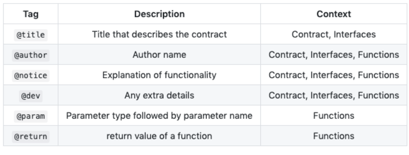

# Solidity

## 数据类型

* int ：integer
* uint ：unsigned integer
* string ：string
* address ：20byte（80bits） ，不支持任何算术操作，适用于存储合约的地址或其他人的公私钥。
* mapping ：mapping可以被认为是一个哈希表，每一个可能的key对应的value被虚拟的初始化为全0.这个类比不是很严谨，对于一个mapping，无法获取一个包含其所有key或者value的链表。所以我们得自己记着添加了哪些东西到mapping中。更好的方式是维护一个这样的链表，或者使用其他更高级的数据类型。

**solidity中函数名不能和变量名重复。**


## 合约 contract

在Solidity中，一个合约由一组代码（合约的函数）和数据（合约的状态）组成。合约位于以太坊区块链上的一个特殊地址。

```javascript
contract Coin {
//关键字“public”使变量能从合约外部访问。
    address public minter;
    mapping (address => uint) public balances;

//事件让轻客户端能高效的对变化做出反应。
    event Sent(address from, address to, uint amount);

//这个构造函数的代码仅仅只在合约创建的时候被运行。
    function Coin() {
        minter = msg.sender;
    }
    function mint(address receiver, uint amount) {
        if (msg.sender != minter) return;
        balances[receiver] += amount;
    }
    function send(address receiver, uint amount) {
        if (balances[msg.sender] < amount) return;
        balances[msg.sender] -= amount;
        balances[receiver] += amount;
        Sent(msg.sender, receiver, amount);
    }
}
```

**msg（以及tx和block）是一个神奇的全局变量，它包含了一些可以被合约代码访问的属于区块链的属性。msg.sender 总是存放着当前函数的外部调用者的地址。**

## 交易 / 事务

区块链是一个全局共享的，事务性的数据库。这意味着参与这个网络的每一个人都可以读取其中的记录。如果你想修改这个数据库中的东西，就必须创建一个事务，并得到其他所有人的确认。事务这个词意味着你要做的修改（假如你想同时修改两个值）只能被完完全全的实施或者一点都没有进行。

此外，一个事务会被发送者（创建者）进行密码学签名。这项措施非常直观的为数据库的特定修改增加了访问保护。

## 区块

区块链要解决的一个主要难题，在比特币中被称为“双花攻击”。当网络上出现了两笔交易，都要花光一个账户中的钱时，会发生什么？一个冲突？

简单的回答是你不需要关心这个问题。这些交易会被排序并打包成“区块”，然后被所有参与的节点执行和分发。如果两笔交易相互冲突，排序靠后的交易会被拒绝并剔除出区块。

这些区块按时间排成一个线性序列。这也正是“区块链”这个词的由来。区块以一个相当规律的时间间隔加入到链上。对于以太坊，这个间隔大致是17秒。

作为“顺序选择机制”（通常称为“挖矿”）的一部分，一段区块链可能会时不时被回滚。但这种情况只会发生在整条链的末端。回滚涉及的区块越多，其发生的概率越小。所以你的交易可能会被回滚，甚至会被从区块链中删除。但是你等待的越久，这种情况发生的概率就越小。

## 以太坊虚拟机

以太坊虚拟机（EVM）是以太坊中智能合约的运行环境。它不仅被沙箱封装起来，事实上它被完全隔离，也就是说运行在EVM内部的代码不能接触到网络、文件系统或者其它进程。甚至智能合约与其它智能合约只有有限的接触。

### 账户

以太坊中有两类账户，它们共用同一个地址空间。外部账户，该类账户被公钥-私钥对控制（人类）。合约账户，该类账户被存储在账户中的代码控制。

外部账户的地址是由公钥决定的，合约账户的地址是在创建该合约时确定的（这个地址由合约创建者的地址和该地址发出过的交易数量计算得到，地址发出过的交易数量也被称作"nonce"）

合约账户存储了代码，外部账户则没有，除了这点以外，这两类账户对于EVM来说是一样的。

每个账户有一个key-value形式的持久化存储。其中key和value的长度都是256比特，名字叫做storage.

另外，每个账户都有一个以太币余额（单位是“Wei"），该账户余额可以通过向它发送带有以太币的交易来改变。

### 交易

一笔交易是一条消息，从一个账户发送到另一个账户（可能是相同的账户或者零账户，见下文）。交易可以包含二进制数据（payload）和以太币。

如果目标账户包含代码，该代码会执行，payload就是输入数据。

如果目标账户是零账户（账户地址是0），交易将创建一个新合约。正如上文所讲，这个合约地址不是零地址，而是由合约创建者的地址和该地址发出过的交易数量（被称为nonce）计算得到。创建合约交易的payload被当作EVM字节码执行。**执行的输出做为合约代码被永久存储。这意味着，为了创建一个合约，你不需要向合约发送真正的合约代码，而是发送能够返回真正代码的代码。**

### Gas

以太坊上的每笔交易都会被收取一定数量的gas，gas的目的是限制执行交易所需的工作量，同时为执行支付费用。当EVM执行交易时，gas将按照特定规则被逐渐消耗。

gas price（以太币计）是由交易创建者设置的，发送账户需要预付的交易费用 = gas price * gas amount。 如果执行结束还有gas剩余，这些gas将被返还给发送账户。

无论执行到什么位置，一旦gas被耗尽（比如降为负值），将会触发一个out-of-gas异常。当前调用帧所做的所有状态修改都将被回滚。

### 存储，主存和栈

每个账户有一块持久化内存区域被称为存储。其形式为key-value，key和value的长度均为256比特。在合约里，不能遍历账户的存储。相对于另外两种，存储的读操作相对来说开销较大，修改存储更甚。一个合约只能对它自己的存储进行读写。

第二个内存区被称为主存。合约执行每次消息调用时，都有一块新的，被清除过的主存。主存可以以字节粒度寻址，但是读写粒度为32字节（256比特）。操作主存的开销随着其增长而变大（平方级别）。

EVM不是基于寄存器，而是基于栈的虚拟机。因此所有的计算都在一个被称为栈的区域执行。栈最大有1024个元素，每个元素256比特。对栈的访问只限于其顶端，方式为：允许拷贝最顶端的16个元素中的一个到栈顶，或者是交换栈顶元素和下面16个元素中的一个。所有其他操作都只能取最顶的两个（或一个，或更多，取决于具体的操作）元素，并把结果压在栈顶。当然可以把栈上的元素放到存储或者主存中。但是无法只访问栈上指定深度的那个元素，在那之前必须要把指定深度之上的所有元素都从栈中移除才行。

### 指令集

EVM的指令集被刻意保持在最小规模，以尽可能避免可能导致共识问题的错误实现。所有的指令都是针对256比特这个基本的数据类型的操作。具备常用的算术，位，逻辑和比较操作。也可以做到条件和无条件跳转。此外，合约可以访问当前区块的相关属性，比如它的编号和时间戳。

### 消息调用

合约可以通过消息调用的方式来调用其它合约或者发送以太币到非合约账户。消息调用和交易非常类似，它们都有一个源，一个目标，数据负载，以太币，gas和返回数据。事实上每个交易都可以被认为是一个顶层消息调用，这个消息调用会依次产生更多的消息调用。

一个合约可以决定剩余gas的分配。比如内部消息调用时使用多少gas，或者期望保留多少gas。如果在内部消息调用时发生了out-of-gas异常（或者其他异常），合约将会得到通知，一个错误码被压在栈上。这种情况只是内部消息调用的gas耗尽。在solidity中，这种情况下发起调用的合约默认会触发一个人工异常。这个异常会打印出调用栈。就像之前说过的，被调用的合约（发起调用的合约也一样）会拥有崭新的主存并能够访问调用的负载。调用负载被存储在一个单独的被称为calldata的区域。调用执行结束后，返回数据将被存放在调用方预先分配好的一块内存中。

调用层数被限制为1024，因此对于更加复杂的操作，我们应该使用循环而不是递归。

### 代码调用和库

存在一种特殊类型的消息调用，被称为callcode。它跟消息调用几乎完全一样，只是加载自目标地址的代码将在发起调用的合约上下文中运行。

这意味着一个合约可以在运行时从另外一个地址动态加载代码。存储，当前地址和余额都指向发起调用的合约，只有代码是从被调用地址获取的。

这使得Solidity可以实现”库“。可复用的库代码可以应用在一个合约的存储上，可以用来实现复杂的数据结构。

### 日志

在区块层面，可以用一种特殊的可索引的数据结构来存储数据。这个特性被称为日志，Solidity用它来实现事件。合约创建之后就无法访问日志数据，但是这些数据可以从区块链外高效的访问。因为部分日志数据被存储在布隆过滤器（Bloom filter) 中，我们可以高效并且安全的搜索日志，所以那些没有下载整个区块链的网络节点（轻客户端）也可以找到这些日志。

### 创建

合约甚至可以通过一个特殊的指令来创建其他合约（不是简单的向零地址发起调用）。创建合约的调用跟普通的消息调用的区别在于，负载数据执行的结果被当作代码，调用者/创建者在栈上得到新合约的地址。

### 自毁

只有在某个地址上的合约执行自毁操作时，合约代码才会从区块链上移除。合约地址上剩余的以太币会发送给指定的目标，然后其存储和代码被移除。

注意，即使一个合约的代码不包含自毁指令，依然可以通过代码调用(callcode)来执行这个操作。

# 开始

## 申明代码版权：

* Every source file should start with a comment indicating its license:

  (The file is under the [MIT](https://spdx.org/licenses/MIT.html) license.)

  ```
  // SPDX-License-Identifier: MIT
  ```

If you do not want to specify a license or if the source code is not open-source, please use the special value `UNLICENSED`.

## Pragmas（注释）

* pragma关键字用于启用或检查某些编译器特性。

A pragma directive is always local to a source file, so you have to add the pragma to all your files if you want to enable it in your whole project. If you [import](https://docs.soliditylang.org/en/latest/layout-of-source-files.html#import) another file, the pragma from that file does *not* automatically apply to the importing file.

注释不被继承，如果你要通过注释去限制一些内容，那么你在每个文件里都需要写。

### versions pragmas (指定编译器版本)

应该文件中指定编译器版本，避免代码在某些版本的编译中行不通，或者预防在将来的编译器中不兼容。

编译器版本格式： `0.x.0` 或者 `x.0.0`.

The version pragma is used as follows: `pragma solidity ^0.5.2;`（指明以0.5开头的版本）

```
pragma solidity >=0.7.0 <0.9.0;
```

指定编译器版本并不会改变编译器的版本，也不会根据你的注释启用或禁用某系功能，只是让编译器去检查是否符合你声明的版本，不符合就抛出错误。

### Experimental Pragma（启用实验性功能）

It can be used to enable features of the compiler or language that are not yet enabled by default. The following experimental pragmas are currently supported:

* ABIEncoderV2

Because the ABI coder v2 is not considered experimental anymore, it can be selected via `pragma abicoder v2` (please see above) since Solidity 0.7.4.

在0.7.4之后如果默认为v2，`pragma abicoder v1`指定为v1

* SMTChecker

`pragma experimental SMTChecker;`启用代码安全性检测

### 引入源文件

三种方式：

```
import "filename";
import * as symbolName from "filename";
import "filename" as symbolName;
```

如果引入的文件里和现文件存在命名冲突：

```
import {symbol1 as alias, symbol2} from "filename";
```

### 注释

* 单行注释`//` 和多行注释`/**/`

* Natspec comment

The Natspec commenting format follows the **Doxygen notation** style:

- Single line comments, using three slashes `///`
- Multi-line comments, using double asterisk block `/** ... */`
- Comments are included above `function` , `contract` , `library`, `interface`, `function` and `constructor`.



- `@notice` : information about what a function does, shown to user when the function executes
- `@dev` : Function documentation for developer.

**If no tag is used (only `///`), then the comment applies to `@notice`.**

## Structure of a Contract

Each contract can contain declarations of **State Variables, Functions, Function Modifiers, Events, Errors, Struct Types and Enum Types. Furthermore,** contracts can inherit from other contracts.

There are also special kinds of contracts called libraries and interfaces.

* **State variables** are variables whose values are permanently stored in contract storage.
* **Functions** are the executable units of code. Functions are usually defined inside a contract, **but they can also be defined outside of contracts.**

```
// SPDX-License-Identifier: GPL-3.0
pragma solidity >=0.7.1 <0.9.0;

contract SimpleAuction {
    function bid() public payable { // Function
        // ...
    }
}

// Helper function defined outside of a contract
function helper(uint x) pure returns (uint) {
    return x * 2;
}
```

## Function modifiers(函数修改器)

Function modifiers can be used to amend the semantics of functions in a declarative way 。 	 	

`修改器(Modifiers)`可以用来轻易的改变一个函数的行为。比如用于在函数执行前检查某种前置条件。修改器是一种合约属性，可被继承，同时还可被派生的合约`重写(override)`。

函数修改器不可重载：

* Overloading, that is, having the same modifier name with different parameters, is not possible.

代码实例：

```php
pragma solidity ^0.4.11;

contract owned {
    function owned() public { owner = msg.sender; }
    address owner;

    // This contract only defines a modifier but does not use
    // it: it will be used in derived contracts.
    // The function body is inserted where the special symbol
    // `_;` in the definition of a modifier appears.
    // This means that if the owner calls this function, the
    // function is executed and otherwise, an exception is
    // thrown.
    定义了一个modifier但是没有使用，将在继承的合约中使用
    函数体将在特殊符号 _ 出现的位置被插入
    这里代表的是只有Owner调用这个方法时才会被执行，否则报错
    modifier onlyOwner {
        require(msg.sender == owner);
        _;
    }
}

contract mortal is owned {
    // This contract inherits the `onlyOwner` modifier from
    // `owned` and applies it to the `close` function, which
    // causes that calls to `close` only have an effect if
    // they are made by the stored owner.
    这个合约从owned继承了onlyOwner的modifier，应用在close方法上
    这将造成只有Owner才能调用close方法
    function close() public onlyOwner {
        selfdestruct(owner);
    }
}

contract priced {
    // Modifiers can receive arguments:
    modifiers可以接受参数
    modifier costs(uint price) {
        if (msg.value >= price) {
            _;
        }
    }
}

contract Register is priced, owned {
    mapping (address => bool) registeredAddresses;
    uint price;

    function Register(uint initialPrice) public { price = initialPrice; }

    // It is important to also provide the
    // `payable` keyword here, otherwise the function will
    // automatically reject all Ether sent to it.
    function register() public payable costs(price) {
        registeredAddresses[msg.sender] = true;
    }

    function changePrice(uint _price) public onlyOwner {
        price = _price;
    }
}

contract Mutex {
    bool locked;
    modifier noReentrancy() {
        require(!locked);
        locked = true;
        _;
        locked = false;
    }

    /// This function is protected by a mutex, which means that
    /// reentrant calls from within `msg.sender.call` cannot call `f` again.
    /// The `return 7` statement assigns 7 to the return value but still
    /// executes the statement `locked = false` in the modifier.
    function f() public noReentrancy returns (uint) {
        require(msg.sender.call());
        return 7;
    }
}
```

那么modifier在solidity中做工作就是给继承这个modifier修饰的function加上一个特定的约束，比如

```cpp
  modifier isOwner() {
     if (msg.sender != owner) {
          throw;
      }
      _; // 继续执行余下的代码体（其实就是isOwner里的实际代码）
  }
  
  doSomething() isOwner {
    // 将会检查调用者是不是Owner
  
    // code
  }
```