# 华迪笔记

## Java

### Java实现Date和Timestamp的相互转换

```java
Timestamp createTime = new Timestamp(new Date().getTime());
//Timestamp转Date
Timestamp t = new Timestamp(System.currentTimeMillis());
Date d = new Date(t.getTime());
```

### list中存放map，根据map中的某个key去重:

```java
List<Map<String, String>> list =new ArrayList<Map<String, String>>();

Map<String, String> data=new LinkedHashMap<String, String>();
........
{
 data.put("userId", Optional.ofNullable(objects[0]).orElse("").toString());
 data.put("userName", Optional.ofNullable(objects[1]).orElse("").toString());
 data.put("phone", Optional.ofNullable(objects[2]).orElse("").toString());
 data.put("orgName", Optional.ofNullable(objects[3]).orElse("").toString());
 list.add(data);
}
....
list.stream().collect(Collectors.collectingAndThen(Collectors.toCollection(
            () -> new TreeSet<>(Comparator.comparing(
   m -> ((Map<String, String>)m).get("userId")))), ArrayList::new));
```

### hibernate两次查询会出现的问题

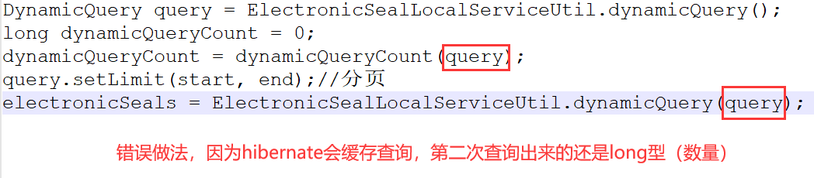

***

### hibernate not in（）查询

```java
public DataResult<JSONArray> getOrganizationByCondition(String accreditedOrgIds){
    //accreditedOrgIds是前端传回来的id数组
		if(Validator.isNotNull(accreditedOrgIds)){
			DynamicQuery subDynamicQuery = OrganizationLocalServiceUtil.dynamicQuery();
			subDynamicQuery.setProjection(ProjectionFactoryUtil.property("organizationId"));
			subDynamicQuery.add(PropertyFactoryUtil.forName("organizationId").in(JSONArray.parseArray(accreditedOrgIds, Long.class)));
			dynamicQuery.add(PropertyFactoryUtil.forName("organizationId").notIn(subDynamicQuery));
			countQuery.add(PropertyFactoryUtil.forName("organizationId").notIn(subDynamicQuery));
		}
	
	}
	
```

### 判断是否为小数，是则保留小数点后两位

```java
private Object dealValue(Object val){
        try {
           double dNumber = Double.parseDouble(val.toString());
            BigDecimal bg = new BigDecimal(dNumber);
            double rNumber = bg.setScale(2, BigDecimal.ROUND_HALF_UP).doubleValue();
            return rNumber;
        } catch(NumberFormatException e){
            return val;
        }
    }
```

### 身份证隐藏部分信息

```java
userIdPartNum = IDNumber.replaceAll("(?<=[\\w]{3})\\w(?=[\\w]{4})", "*");
```


### 将List集合中的对象的某个属性提取出来组成List

```java
List<ElectronicSeal> electronicSeals = ElectronicSealLocalServiceUtil.dynamicQuery(query);
List<Map<String, Object>> datas = electronicSeals.stream().map(ElectronicSeal::getModelAttributes).collect(Collectors.toList());

```

* 进阶：获取多个属性或者按条件过滤

```java
List<PersonDo> list=new ArrayList<>();
    list.add(new PersonDo("藏三",17,"男",167L,60L));
    list.add(new PersonDo("李肆",18,"未知",180L,100L));
    list.add(new PersonDo("王武",19,"女",172L,55L));


    List<String> nameList = list.stream().map(PersonDo::getName).collect(Collectors.toList());
    System.out.println("只获取一个元素：————————");
    for (String name:nameList) {
        System.out.println(name);
    }
    System.out.println();

    Map<String, Integer> nameAndAgeList = list.stream().collect(Collectors.toMap(PersonDo::getName, PersonDo::getAge));
    System.out.println("获取两个元素：————————");
    for (Map.Entry<String, Integer> map:nameAndAgeList.entrySet()) {
        System.out.println(map.getKey()+","+map.getValue());
    }
    System.out.println();

    List<PersonDo> personDoList = list.stream().filter(man -> "王武".equals(man.getName())).collect(Collectors.toList());
    System.out.println("条件过滤：————————");
    for (PersonDo p:personDoList) {
        System.out.println(p.toString());
    }
    System.out.println();

    Map<String, Integer> nameAndAgeWithFileByName = list.stream().filter(man -> "藏三".equals(man.getName())).collect(Collectors.toMap(PersonDo::getName, PersonDo::getAge));
    System.out.println("条件过滤+部分属性：————————");
    for (Map.Entry<String, Integer> map:nameAndAgeWithFileByName.entrySet()) {
        System.out.println(map.getKey()+","+map.getValue());
    }

```

### List和以“，”逗号分隔的字符串相互转换

* 常用于sql中in()的拼接

```java
//字符串转list
String str = "a,b,c"; 
List<String> result = Arrays.asList(str.split(","));
//	List<String>转List<Long>
        List<Long> cdids = list.stream().map(s -> Long.parseLong(s.trim())).collect(Collectors.toList());
//list转字符串
List<String> list= Arrays.asList("aaa",  "bbb", "ccc", "ddd");
String str= String.join(",", list);
//假如为List<Long> idsList .......
String str= idsList.stream().map(String::valueOf).collect(Collectors.joining(","));

```


### java代码中执行系统命令

在java中，RunTime.getRuntime().exec()实现了调用服务器命令脚本来执行功能需要。

如果我们想在500秒后使电脑关机，通过Runtime.getRuntime().exec()我们可以这样写:

```java
//添加一个60S后自动关闭计算机的计划。
Runtime.getRuntime().exec(shutdown -s -t 500);
```

**两个例子：**

1. 备份mysql数据库：

```java
/**数据库备份成sql文件
	 * mysqldump --opt --column-statistics=0 -h192.168.190.11 --user=root --			password=Root2021@ 
	 * --lock-all-tables=true --result-file=/home/hwadee/2021-08-24-databackup.sql 
	 * --default-character-set=utf8 cqlcb
	 *其中cqlcb为数据库名
	 */
	public  boolean backupDatabaseToSQL() {
	String url = PropsUtil.get(PropsKeys.JDBC_DEFAULT_URL);
	String cleanURI = url.substring(5);
	URI uri = URI.create(cleanURI);
	String hostIP=uri.getHost();
	String databaseName=uri.getPath().substring(1);
	String password = PropsUtil.get( PropsKeys.JDBC_DEFAULT_PASSWORD);
	String userName = PropsUtil.get(PropsKeys.JDBC_DEFAULT_USERNAME);
	
	String savePath =DataBackupConstant.DATABASE_BACKUP_PATH;
	String fileName = DataBackupConstant.getDatabaseBackupTargetPath();
	File saveFile = new File(savePath);

	if (!saveFile.exists()) {// 如果目录不存在
		saveFile.mkdirs();// 创建文件夹
	}
	if (!savePath.endsWith(File.separator)) {
		savePath = savePath + File.separator;
	}
	PrintWriter printWriter = null;
	BufferedReader bufferedReader = null;

	try {
		printWriter = new PrintWriter(new OutputStreamWriter(new FileOutputStream(savePath + fileName), "utf8"));
		StringBuilder stringBuilder = new StringBuilder();
		stringBuilder.append("mysqldump").append(" --opt").append(" -h").append(hostIP);
		stringBuilder.append(" --user=").append(userName).append(" --password=").append(password)
		.append(" --lock-tables=true");
		stringBuilder.append(" --result-file=").append(savePath + fileName).append(" --default-character-set=utf8 ")
		.append(databaseName);
		Process process = Runtime.getRuntime().exec(stringBuilder.toString());
		InputStreamReader inputStreamReader = new InputStreamReader(process.getInputStream(), "utf8");
		bufferedReader = new BufferedReader(inputStreamReader);
		String line;
		while ((line = bufferedReader.readLine()) != null) {
		printWriter.println(line);
	
		}
		printWriter.flush();
	
		if (process.waitFor() == 0) {// 0 表示线程正常终止。
			return true;
		}

	} catch (IOException | InterruptedException) {
		e.printStackTrace();
	} finally {
		try {
			if (bufferedReader != null) {
				bufferedReader.close();
			}
			if (printWriter != null) {
				printWriter.close();
			}
		} catch (IOException e) {
			e.printStackTrace();
		}
	}	
	return false;

	}
```

2. 备份系统中的文件夹：

windows:

```java
public boolean backupFolder() {
		try {
			String location = "E:\\project\\"; //File path you are getting from file chooser
			String target = "F:\\backup\\";
			File locFile = new File(target);
			File tarFile = new File(target);
			copyDirectory(locFile, tarFile);
			return true;
		} catch (IOException ex) {
			ex.printStackTrace();
		}
		return false;
		
	}
	public void copy(File sourceLocation, File targetLocation) throws IOException {
        if (sourceLocation.isDirectory()) {
            copyDirectory(sourceLocation, targetLocation);
        } else {
            copyFile(sourceLocation, targetLocation);
        }
    }
    private void copyDirectory(File source, File target) throws IOException {
        if (!target.exists()) {
            target.mkdir();
        }

        for (String f : source.list()) {
            copy(new File(source, f), new File(target, f));
        }
    }

    private void copyFile(File source, File target) throws IOException {
        try (
                InputStream in = new FileInputStream(source);
                OutputStream out = new FileOutputStream(target)) {
            byte[] buf = new byte[1024];
            int length;
            while ((length = in.read(buf)) > 0) {
                out.write(buf, 0, length);
            }
        }
    }

```

linux:

```java
public boolean backupWebFolder() {
        try {
            SimpleDateFormat sdf = new SimpleDateFormat("yyyyMMDD");
            Date date=new Date();
            StringBuilder stringBuilder =new StringBuilder();
            String tempString = DataBackupConstant.WEB_BACKUP_TARGET_FOLDER.substring(0,DataBackupConstant.WEB_BACKUP_TARGET_FOLDER.length()-2);
            String partFileName = tempString.substring(tempString.lastIndexOf("/"));
            stringBuilder.append("tar -zcPvf ").append(DataBackupConstant.WEB_BACKUP_TARGET_FOLDER).append(partFileName)
            .append(sdf.format(date)).append(".tar  ")
            .append(DataBackupConstant.WEB_FOLDER_LOCATION);
            Process process = Runtime.getRuntime().exec(stringBuilder.toString());
            if (process.waitFor() == 0) {// 0 表示线程正常终止。
            	
            	return true;
            }
        } catch (IOException | InterruptedException ex) {
            ex.printStackTrace();
        }
		return false;
        
    }
```

### 查询出来的数据合并转换

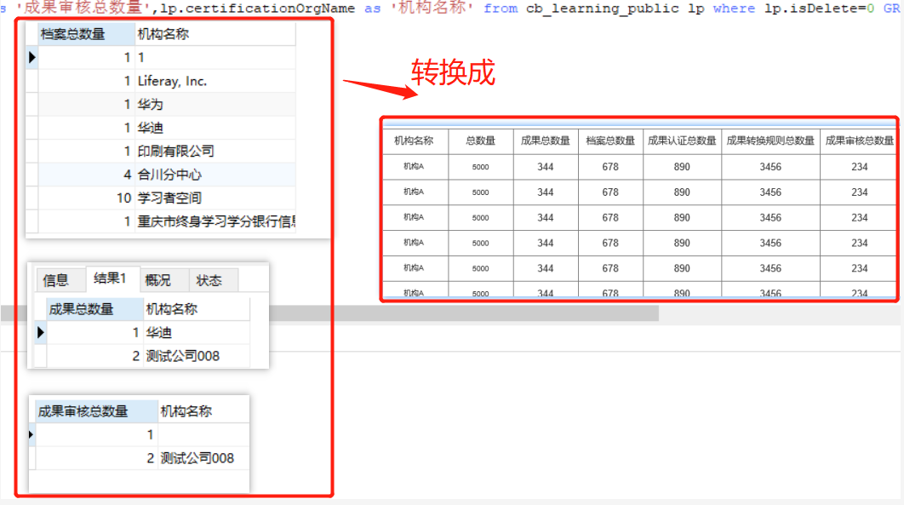

```java

JSONArray res = new JSONArray();
List<Object[]> archiveRes = DBUtil.executeSQLQuery(archiveSQL.toString());
			List<Object[]> outcomeNumRes = DBUtil.executeSQLQuery(outcomeNumSQL.toString());
			List<Object[]> outcomeAuditRes = DBUtil.executeSQLQuery(outcomeAuditSQL.toString());
			List<Object[]> outcomeAuthRes = DBUtil.executeSQLQuery(outcomeAuthSQL.toString());
			List<Object[]> outcomeSwitchRes = DBUtil.executeSQLQuery(outcomeSwitchSQL.toString());
			
			
			JSONObject firJsonObject  = new JSONObject();
			res.add(firJsonObject);
			int jsize = res.size();
			for(int i=0;i<archiveRes.size();i++){
				boolean isNew=false;
				for(int j=0;j<jsize;j++){
					JSONObject obj = res.getJSONObject(j);
					if(obj.values().contains(archiveRes.get(i)[1])){
						res.remove(j);
						obj.put("archiveNum", Optional.ofNullable(archiveRes.get(i)[0]).orElse("0").toString());
						res.add(obj);
					}else if(j+1==jsize) {
						isNew=true;
					}
				}
				if(isNew){
					JSONObject newobj = new JSONObject();
					newobj.put("archiveNum", Optional.ofNullable(archiveRes.get(i)[0]).orElse("0").toString());
					newobj.put("orgName", Optional.ofNullable(archiveRes.get(i)[1]).orElse("未知").toString());
					res.add(newobj);
					jsize++;
				}
			}
			
			for(int i=0;i<outcomeSwitchRes.size();i++){
				boolean isNew=false;
				for(int j=0;j<jsize;j++){
					JSONObject obj = res.getJSONObject(j);
					if(obj.values().contains(outcomeSwitchRes.get(i)[1])){
						res.remove(j);
						obj.put("ocSwitchNum", Optional.ofNullable(outcomeSwitchRes.get(i)[0]).orElse("0").toString());
						res.add(obj);
					}else if(j+1==jsize) {
						isNew=true;
					}
				}
				if(isNew) {
					JSONObject newobj = new JSONObject();
					newobj.put("ocSwitchNum", Optional.ofNullable(outcomeSwitchRes.get(i)[0]).orElse("0").toString());
					newobj.put("orgName", Optional.ofNullable(outcomeSwitchRes.get(i)[1]).orElse("未知").toString());
					res.add(newobj);
					jsize++;
				}
			}
			
			for(int i=0;i<outcomeAuthRes.size();i++){
				boolean isNew=false;
				for(int j=0;j<jsize;j++){
					JSONObject obj = res.getJSONObject(j);
					if(obj.values().contains(outcomeAuthRes.get(i)[1])){
						res.remove(j);
						obj.put("ocAuthNum", Optional.ofNullable(outcomeAuthRes.get(i)[0]).orElse("0").toString());
						res.add(obj);
					}else if(j+1==jsize) {
						isNew=true;
					}
				}
				if(isNew) {
					
					JSONObject newobj = new JSONObject();
					newobj.put("ocAuthNum", Optional.ofNullable(outcomeAuthRes.get(i)[0]).orElse("0").toString());
					newobj.put("orgName", Optional.ofNullable(outcomeAuthRes.get(i)[1]).orElse("未知").toString());
					res.add(newobj);
					jsize++;
				}
			}
			
			for(int i=0;i<outcomeAuditRes.size();i++){
				boolean isNew=false;
				for(int j=0;j<jsize;j++){
					JSONObject obj = res.getJSONObject(j);
					if(obj.values().contains(outcomeAuditRes.get(i)[1])){
						res.remove(j);
						obj.put("ocAuditNum", Optional.ofNullable(outcomeAuditRes.get(i)[0]).orElse("0").toString());
						res.add(obj);
					}else if(j+1==jsize) {
						isNew=true;
					}
				}
				if(isNew) {
					JSONObject newobj = new JSONObject();
					newobj.put("ocAuditNum", Optional.ofNullable(archiveRes.get(i)[0]).orElse("0").toString());
					newobj.put("orgName", Optional.ofNullable(outcomeAuditRes.get(i)[1]).orElse("未知").toString());
					res.add(newobj);
					jsize++;
				}
			}		
			for(int i=0;i<outcomeNumRes.size();i++){
				boolean isNew=false;
				for(int j=0;j<jsize;j++){
					JSONObject obj = res.getJSONObject(j);
					if(obj.values().contains(outcomeNumRes.get(i)[1])){
						res.remove(j);
						obj.put("ocNum", Optional.ofNullable(outcomeNumRes.get(i)[0]).orElse("0").toString());
						res.add(obj);
					}else if(j+1==jsize) {
						isNew=true;
					}
				}
				if(isNew) {
					JSONObject newobj = new JSONObject();
					newobj.put("ocNum", Optional.ofNullable(outcomeNumRes.get(i)[0]).orElse("0").toString());
					newobj.put("orgName", Optional.ofNullable(outcomeNumRes.get(i)[1]).orElse("未知").toString());
					res.add(newobj);
					jsize++;
				}
			}
			if(res.size()>0){
				res.remove(0);
			}
```

### 获取两个日期之间的天数

```java
public static double getDistanceOfTwoDate(Date before, Date after) {
		long beforeTime = before.getTime();
		long afterTime = after.getTime();
		return (afterTime - beforeTime) / (1000 * 60 * 60 * 24);
	}
```

### 获取两个日期之间的月数

```java
public static double getDistanceMonth(Date before, Date after){
	     Calendar bef = Calendar.getInstance();
	     Calendar aft = Calendar.getInstance();
	     bef.setTime(before);
	     aft.setTime(after);
	     int result = aft.get(Calendar.MONTH) - bef.get(Calendar.MONTH);
	     int month = (aft.get(Calendar.YEAR) - bef.get(Calendar.YEAR)) * 12;
	     return Math.abs(month + result);
	}
```

### 枚举使用

```java
public enum ScoreSetItem {
	LOG_IN("登录", "login"),
	SWITCH_OUTCOME("转换成果","switchResult"), 
	READ_ARTICLE("阅读文章", "reading"), 
	AUTHEN_OUTCOME("认证成果","authenticationResult");  
    // 成员变量  
    private String name;  
    private String code;  
    // 构造方法  
    private ScoreSetItem(String name, String code) {  
        this.name = name;  
        this.code = code;  
    }  
    public String getChineseName() {  
    	return this.name;  
    }  
    public String getCode() {  
    	return this.code;  
    } 
    public static String getName(String code) {  
        for (ScoreSetItem c : ScoreSetItem.values()) {  
            if (c.getCode().equals(code)) {  
                return c.name;  
            }  
        }  
        return null;  
    }  
}
```

### 获取src下资源

```java
//例子：
String in = Seal.class.getResource("/STFANGSO.TTF").getFile();
			Font localFont = Font.createFont(Font.TRUETYPE_FONT, new FileInputStream(in));
```

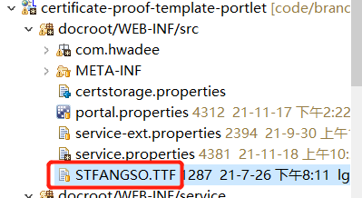

### sql拼接in条件

```java
List<Long> ocidsList= inLst.stream().map(CertificationOutcomeLink::getOutcomeId).collect(Collectors.toList());
sql.append(" and outcomeId in ( ");
String idstr= ocidsList.stream().map(String::valueOf).collect(Collectors.joining(","));
sql.append(idstr).append(" )");
```

### JSONArray和List互转

1.List转JSONArray

```java
List<T> list = new ArrayList<T>();
JSONArray array= JSONArray.parseArray(JSON.toJSONString(list))；
```

2.JSONArray转List

```
JSONArray array = new JSONArray();
List<EventColAttr> list = JSONObject.parseArray(array.toJSONString(), EventColAttr.class);
```


## 前端

```javascript
/* 限制输入为正整数 */
		 $(":text").keyup(function(){
			
			$(this)[0].value=$(this)[0].value.replace(/^(0+)|[^\d]+/g,'');
		}) 
```

```js
//jquery给span赋值
$("#spanid").html(value)

//取值
$("#spanid").text()
```

### 让按钮始终在底部

```html
<style type="text/css">
.aud-btn-div{
			width: 100%;
			position:fixed;
			bottom:50px;
			text-align: center;
		}
		.ad-btn{ 
			text-align: center;
		}
</style>

<div class="aud-div">
    <!-- 列表信息 -->
    <div class="ud-table">
	    <table class="layui-table" id="<portlet:namespace/>oc" lay-filter="tab">
	    </table>
    </div>
    <br>
    <div class="aud-btn-div">
	  	<button type="button" class="ad-btn" id="cancel">返回</button>
    </div>
</div>
```


### 禁用与恢复按钮

```javascript
$('#sendSmsBtn').addClass("layui-btn-disabled").attr("disabled",true);

$('#sendSmsBtn').removeClass("layui-btn-disabled").attr("disabled",false);
```


### js中”===“和”==“的区别

”===“需要类型一致才为true，”==“则不需要。（比如int和String值比较）

```javascript
<script type="text/html" id="bar">
    <!-- 兑换按钮 -->
	{{#  if(d.status == 1){ }}
    <button type="button" class="layui-btn layui-btn-sm" lay-event="release" title="兑换">
       	兑换
    </button>
 	{{#  }}}
</script>
```

### jQuery设置与判空

```javascript
    if (!$("#myTextArea").val()) {
        // textarea is empty
    }

    if (!$.trim($("#myTextArea").val())) {
        // textarea is empty or contains only white-space
    }
//清空输入信息
$("#auditOpinion").val('');
```

### layui弹窗确认

```javascript
	layer.confirm("提示信息",{
		btn: ['按钮1', '按钮2']
	}, function () {
		// 按钮1的事件
	}, function(){
		// 按钮2的事件
	});
```

### input输入框定制(最小输入长度)数据校验

1.html
```html
<input type="text" id="templateTitle" name="templateTitle" onblur=" minVerify(this.value)" maxlength="30" minlength="4">
```
2.js

```js
function minVerify(object){
	var dom=object;
	var value =(dom.value).trim();
	var min = dom.getAttribute('minlength');
    if(value.length < min){
       layui.layer.msg('长度不能小于'+min+'个字符');
       document.getElementById(dom.id).focus();
    }
}
```

### 前端校验输入是否为身份证号 电话号码 邮箱：

```js
//验证是否为手机号或者座机号码
 function isTelCode(str) {
  var reg=/(^(?:(?:0\d{2,3})-)?(?:\d{7,8})(-(?:\d{3,}))?$)|(^0{0,1}1[3|4|5|6|7|8|9][0-9]{9}$)/;
  return reg.test(str);
 }
 
 /*校验正整数*/
 function isPositiveNum(str) {
  var reg= /[1-9]+\d*/;
  return reg.test(str);
 }
 /*校验邮件地址是否合法 */
 function isEmail(str) {
  var reg=/^([a-zA-Z0-9_-])+@([a-zA-Z0-9_-])+(.[a-zA-Z0-9_-])+/;
  return reg.test(str);
 }
 /*校验身份证号是否合法 */
 function isEmail(str) {
  var reg=/(^\d{15}$)|(^\d{18}$)|(^\d{17}(\d|X|x)$)/; 
  return reg.test(str);
 }
 $("#creatorContact").on('blur',function(){
  if(!isTelCode($("#creatorContact").val()) && !isEmail($("#creatorContact").val())){//creatorContact为input框id
    layui.layer.msg("只能留邮箱或者电话");
    document.getElementById("creatorContact").focus();//鼠标回到框中
    
    return false;
  }
    })
```

### 校验正整数

* 输入框

```html
<input type="text"  id="age" name="age" onblur=" numVerify(this)" placeholder="请输入" maxlength="150" minlength="1"  >
```

* js校验

```js
/*校验正整数 */
function numVerify(object){
	var dom=object;
	var value =(dom.value).trim();
	var min = dom.getAttribute('minlength');
	var max = dom.getAttribute('maxlength');
	eval("var reg = /\^[1-9]\\d{" + min+","+(max-1) + "\}$/;");
    var reg = new RegExp(reg);
// 	var reg = /\^[1-9]\\d{" + min+","+(max-1) + "\}$/;
    if(!reg.test(value)){
       layui.layer.msg('只能输入不小于'+min+'、不大于'+max+'的整数');
       document.getElementById(dom.id).focus();
    }
}
```


### jquery遍历下拉框，并将指定值设置为已选中：

```js
var selectorPT = $("select[name=platformTypeSelector]"); //从A1下拉框中 搜索值
            $(selectorPT).children("option").each(function () {
                //console.log(this.index);
                //console.log($(this).text());//每一个option
                var aaa= data.platformTypeName;
                var bbb= $(this).text();
                debugger
                if ($(this).text() === data.platformTypeName) {
                    $("select[name=platformTypeSelector]").find('option:eq('+this.index+')').attr('selected', true);
                }
            });
```

### Jquery 给 select 下拉框赋值

```js
$("#poet").find("option:contains('李白')").attr("selected",true);  
//使用 “option[text='李白']” 这种写法是错误的
$("#poet").find("option[value='1']").attr("selected",true);
```

**给input单选框赋值时也可以采用这种方法，但是略有不同：**

```js
$("#poet").find("input[value='yes']").attr("selected",true);
$("#poet").find("input[text='是']").attr("selected",true);
```

### layui表格监听checkbox是否选中并获取选中行的数据：

```js
table.on('checkbox(table-id)', function(obj){
   console.log(obj.checked); //当前是否选中状态
   console.log(obj.data); //选中行的相关数据
   console.log(obj.type); //如果触发的是全选，则为：all，如果触发的是单选，则为：one
   console.log(table.checkStatus('table-organization').data); // 获取表格中选中行的数据
  });
```

### layui动态append下拉选择框无效时解决办法：

```js
在动态append的代码完成后面添加如下代码：
<script>
        layui.use('form', function() { //此段代码必不可少
            var form = layui.form;
            form.render();
        });
 </script>
```

### layui表格获取数据后改变某一行的背景颜色

```js
 ,page: true
 ,done:function(res,cur,count){
       for(var i =0;i<res.data.length;i++){
            if(res.data[i].isDefaultTemplate==1){
                 $(".layui-table tbody tr").eq(i).css("background-color","grey")
             }
         }
     }
,limits : [20,30,40]
```


### layui 中select下拉change事件失效的解决方法

```js
//1.select中添加 lay-filter=“test”
	
<select lay-filter="test"></select>
//2.处理方法
form.on('select(test)', function(data){
  console.log(data.elem); //得到select原始DOM对象
  console.log(data.value); //得到被选中的值
  console.log(data.othis); //得到美化后的DOM对象
});
```

**例子：**

```html
<form class="layui-form" lay-filter="addeditForm" id="addeditForm">
    <label class="layui-form-label">支付方式</label>
    <select id="paymentType" name="paymentType" readonly placeholder="请选择" lay-filter="typeChange">
        <option value=<%=CqlcbStatus.PAYMENT_MODE_WECHAT %>>微信</option>
        <option value=<%=CqlcbStatus.PAYMENT_MODE_ALIPAY %>>支付宝</option>
    </select>
</form>
```

```js
layui.form.on('select(typeChange)', function(data){
	var sel = $('#paymentType').val();
	$('#extraForm').empty();
	if(sel==<%=CqlcbStatus.PAYMENT_MODE_ALIPAY%>){
		$('#extraForm').append(alipayDiv);
	}else if(sel==<%=CqlcbStatus.PAYMENT_MODE_WECHAT%>){
		$('#extraForm').append(wechatDiv);
	}
	layui.form.render('select');
})
```


### jq判断数组中是否包含某个元素

```js
$.inArray(d.userId, assignedUserIds)//assignedUserIds为数组
```

### js可变参数：

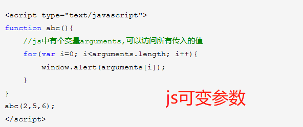

### layui日期选择

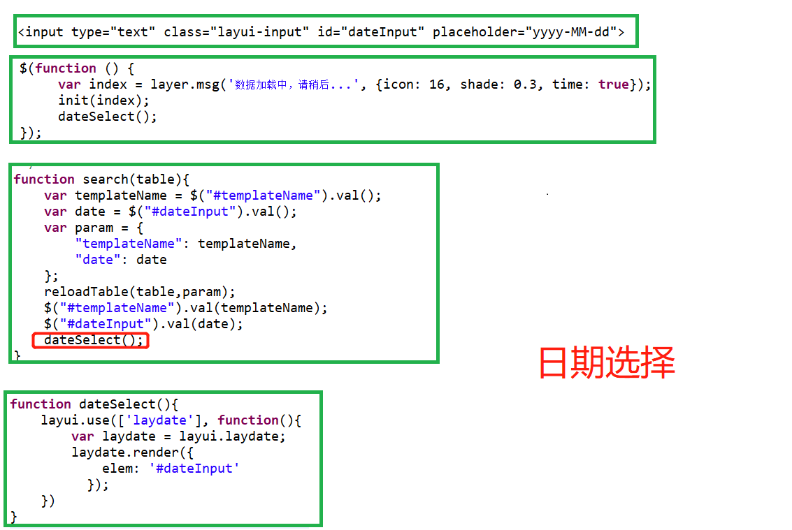

```html
 <input type="text" class="layui-input" id="dateInput" placeholder="yyyy-MM-dd">
```

```js
function dateSelect(){
	layui.use(['laydate'], function(){
	    var laydate = layui.laydate;
	    laydate.render({
	        elem: '#dateInput'
	      });
	})
}
```


### layui在表格中动态添加多个超链接，定制

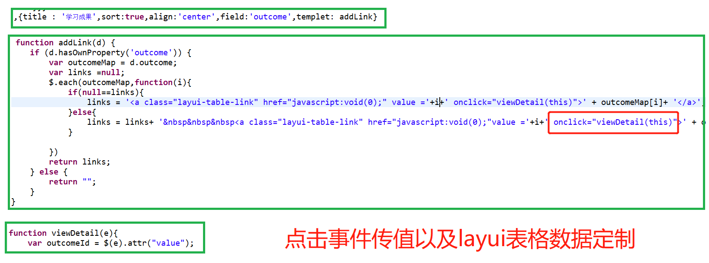

### Long型时间戳转换为日期

```js
function getDateFromStamp(timestamp) {
    if(!timestamp){
		return "";
	}
    //时间戳为10位需*1000，时间戳为13位的话不需乘1000
    var date = new Date(timestamp);
    Y = date.getFullYear() + '-';
    M = (date.getMonth()+1 < 10 ? '0'+(date.getMonth()+1) : date.getMonth()+1) + '-';
    D = date.getDate() + ' ';
    h = date.getHours() + ':';
    m = date.getMinutes() + ':';
    s = date.getSeconds();
    return Y+M+D+h+m+s;
}
```

### 判断文件是否是图片

```js
function isPicFile(fileType) {
    // 后缀名转换为小写
    var fileType = fileType.toLowerCase();
    // 创建格式数组
    var suppotFile = new Array();
    // 存储格式类型
    suppotFile[0] = "jpg";
    suppotFile[1] = "gif";
    suppotFile[2] = "bmp";
    suppotFile[3] = "png";
    suppotFile[4] = "jpeg";
    //判断fileType是否存在数组里面
    for ( var i = 0; i < suppotFile.length; i++) {
        if (suppotFile[i] == fileType) {
            return true;
        }
    }
    //如果不存在返回 false
    //alert("文件类型不合法,只能是jpg、gif、bmp、png、jpeg、png类型！");
    return false;
}
```

调用：

```js
   	for(var i=0;i<obj.total;i++){ 
           		
           		var file=obj.rows[i].url;
           		// 获取最后一个'.'的角标
           		var point = file.lastIndexOf(".");
           		// 抽取字符串
           		var type = file.substr(point+1);
           		if(isPicFile(type)){
           			
           			$("#imgPart").append("<div style='width: 200px;height: 200px;overflow:hidden;border: 1px solid #666;float:left;'>"+""+"</div>");
           		}else{
           			
           			$("#filePart").append("<a href="+file+" >"+obj.rows[i].fileName+"</a><br>");
           		}
           	};
```


### jq判断某个对象是否为空


```js
if(jQuery.isEmptyObject()){
    ...
};
```

### 判断对象是否包含某个属性（自身的、非继承的）

```js
var o = new Object();
o.prop = 'exists';

function changeO() {
  o.newprop = o.prop;
  delete o.prop;
}

o.hasOwnProperty('prop');  // true
changeO();
o.hasOwnProperty('prop');  // false


```

**注意 hasOwnProperty 作为属性名**

JavaScript 并没有保护 hasOwnProperty 属性名，因此，可能存在于一个包含此属性名的对象，有必要使用一个可扩展的hasOwnProperty方法来获取正确的结果：

```js
var foo = {
    hasOwnProperty: function() {
        return false;
    },
    bar: 'Here be dragons'
};
foo.hasOwnProperty('bar'); // 始终返回 false
// 如果担心这种情况，可以直接使用原型链上真正的 hasOwnProperty 方法
// 使用另一个对象的`hasOwnProperty` 并且call
({}).hasOwnProperty.call(foo, 'bar'); // true

// 也可以使用 Object 原型上的 hasOwnProperty 属性
Object.prototype.hasOwnProperty.call(foo, 'bar'); // true
```


### 取字符串前面几位或者取后面几位

```js
var date = $("#peroidInput").val();//"2021-08-03 - 2021-09-03"
var startDate = date.substring(0,10);
var endDate = date.substring(date.length-10,date.length);
```


### localStorage存储map


### 前端传数组到后台解析

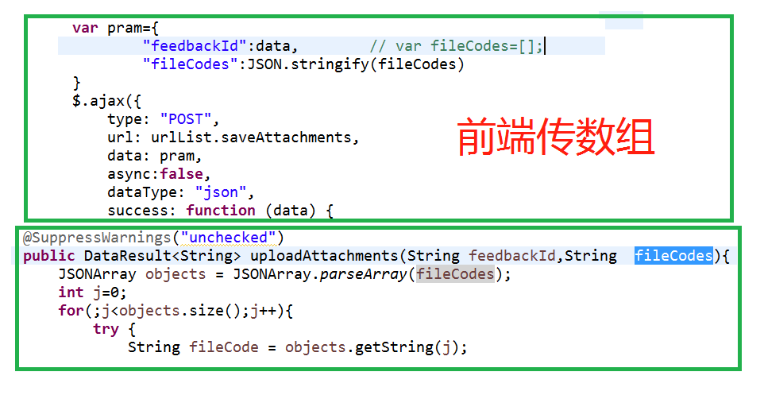

### jq遍历map

```js
$.each(typeMap, function(i) {
		achieveTypes.push(i);
		typeValues.push(typeMap[i]);
		if(maxNumber < typeMap[i]){
			maxNumber = typeMap[i];
		}
    });
```

### 遍历数组

```js
$.each(arr,function(index,value){
     alert(i+"..."+value);
});
```

### 遍历数组里(数组里存放map)

```js
$.each(z, function(i,v) {
    var key =Object.keys(v)[0];
    days.push(key);
    dayNums.push(v[key])
});
```


### jquery合并两个map（也可两个对象）

```js
//merging two objects into new object
var new_object = $.extend({}, object1, object2);

//merge object2 into object1
$.extend(object1, object2);
```

### 数组里的map遍历

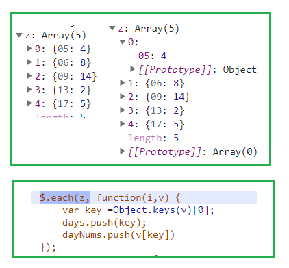

```js
var days=[];
var dayNums=[];

var z= res.rows;

$.each(z, function(i,v) {
    var key =Object.keys(v)[0];
    days.push(key);
    dayNums.push(v[key])
});
```

### for-in遍历数组的坑

```js
// 遍历对象 通常用for in来遍历对象的键名
const userInfo = {
	name: 'zhangsan',
	age: 20,
	gender: 'male'
}
for (let item in userInfo) {
	console.log(item) // 对象的key: name age gender
	console.log(userInfo[item]) // 对象的value: zhangsan 20 male
}

// for in 可以遍历到myObject的原型方法method,如果不想遍历原型方法和属性的话，可以在循环内部做一个判断,
// 用hasOwnProperty方法可以判断某属性是否是该对象的实例属性
for (let key in userInfo) {
	if (userInfo.hasOwnProperty(key)) {
		console.log(key)
	}
}
```

```javascript
// 遍历数组
const arr = [1, 2, 3, 4, 5]
for (let value of arr) {
	console.log(value)
}
// 遍历map对象时适合用解构
for (var [key, value] of userInfo) {
   console.log(key + "'s name is: " + value);
}
// for..of适用遍历数组，数组对象，字符串，map，set等拥有迭代器对象的集合.但是不能遍历对象,因为没有迭代器对象.
// 与forEach()不同的是，它可以正确地 使用break、continue和return语句
// for-of循环不支持普通对象，但如果你想迭代一个对象的属性，你可以用for-in循环
```

###  获取下拉框选中的文本问题

```js
本来以为jQuery("#select1").val();是取得选中的值，
那么jQuery("#select1").text();就是取得的文本。
这是不正确的，正确做法是：
jQuery("#select1  option:selected").text();
```

### JSON

用JSON.stringify()将对象a变成了字符串c，那么我就可以用JSON.parse()将字符串c还原成对象a。在使用JSON.parse()需要注意一点，由于此方法是将JSON字符串转换成对象，所以你的字符串必须符合JSON格式，即键值都必须使用双引号包裹

### 获得(移除)某个table某一行后的所有行

```js
$("table tr").eq(1).nextAll().remove();
```

### jquery动态给表格设置序号：

```js
{
    //$('table tr:not(:first)').remove();
        var len = $('table tr').length;
        for(var i = 1;i<len;i++){
            $('table tr:eq('+i+') td:first').text(i);
        }
}
```

### jq删除某个数组元素

```js
公式：
　　数组.splice($.inArray(元素,数组),数量);
实例：
　　var arr = ['a','b','c','d'];
　　arr.splice($.inArray('c',arr),1);
　　
　　结果：arr =['a','b','d']
```

### jq删除map里的某个元素

```js
 delete fileMap[key];
```


### ajax取消异步

```js
//取消异步
$.ajaxSettings.async = false;
//设置异步
$.ajaxSettings.async = true;
```

### 使用三元简写if多条件判断语句时，必须有else语句结束

* 错误：

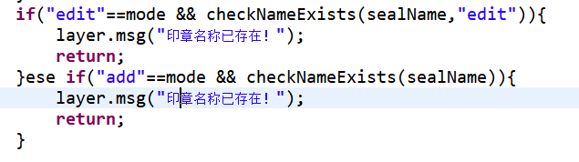

* 解决方案：

```js
a条件？Something
:b条件 ? Something
:Something;
```

### Jquery 实现监控form表单内数据是否变化

* 1.表单打开时获取现有表单数据

```js
$(function () {
	$("#btn_save_enable").addClass("layui-btn-disabled");
	$("#btn_save").addClass("layui-btn-disabled");
	 jsonFormInit = $("form").serialize();
}
```

* 2.表单输入项值监听

```js
$("input, textarea,select").bind('change',function () {
	var jsonFormCurr = $("form").serialize();
	if (jsonFormCurr != jsonFormInit) {
		$("#btn_save_enable").removeClass("layui-btn-disabled");
		$("#btn_save").removeClass("layui-btn-disabled");
	} else {
		$("#btn_save_enable").addClass("layui-btn-disabled");
		$("#btn_save").addClass("layui-btn-disabled");
		layui.form.render();
	}
});

//解决上面的select值改变事件失效
layui.form.on('select(sealSelect)', function(data){
	var jsonFormCurr = $("form").serialize();
	if (jsonFormCurr != jsonFormInit) {
		$("#btn_save_enable").removeClass("layui-btn-disabled");
		$("#btn_save").removeClass("layui-btn-disabled");
	} else {
		$("#btn_save_enable").addClass("layui-btn-disabled");
		$("#btn_save").addClass("layui-btn-disabled");
		layui.form.render();
	}
})

```

### layui监听开关按钮

```html
 <input type="checkbox" id="isDefaultTemplate" lay-skin="switch" value="1" lay-filter="switchIsDefault" lay-text="是|否"> 
```

```js
  layui.use(['form'], function(){
    	var form = layui.form;
   		 form.on('switch(switchIsDefault)',function(data){
    		var isDefault =this.checked;
    		var templateType  =$('#certificateProofType').val();
    		var aa =$('#isDefaultTemplate').val();
    		var checked = data.elem.checked;
    		if(isDefault){
    			$('#isDefaultTemplate').val(1);
    			$.post(urlList.checkDefaultExists,{type :templateType },function(res){
    				console.log(res);
    				if(res){
    					layer.msg("系统中已存在相同类型的默认模板！");
    					$('#isDefaultTemplate').removeAttr("checked");//取消打开
    					form.render("checkbox");
//     					data.othis[0].classList.remove('layui-form-onswitch');
//     		    		$(data.othis[0]).text("否");
    				}
    			});
    		}else{
    			$('#isDefaultTemplate').val(0);
    		}
    	})
    })
```


### layui2.6.6以前上传多图片和文件，并显示进度条

* 效果：

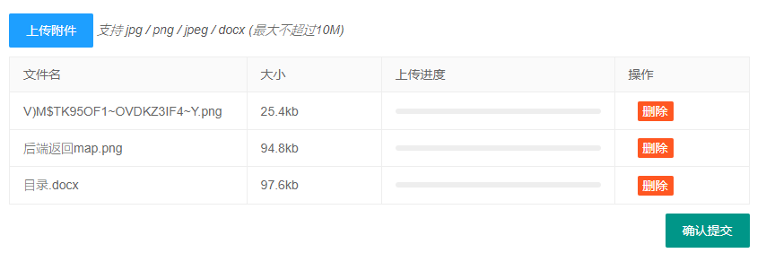

* 页面

```html
<div class="layui-upload" id="upBlock">
	<button type="button" class="layui-btn layui-btn-normal" id="testList">上传附件</button> 
	<span><i>支持 jpg / png / jpeg / docx (最大不超过10M)</i></span>
		<div class="layui-upload-list" style="max-width: 1000px;">
			<table class="layui-table" id="fileTable">
				<colgroup>
					<col>
					<col width="150">
					<col width="260">
					<col width="150">
				</colgroup>
				<thead>
				<tr><th>文件名</th>
					<th>大小</th>
					<th>上传进度</th>
					<th>操作</th>
				</tr></thead>
				<tbody id="demoList"></tbody>
			</table>
		</div>
	<button type="button" class="layui-btn layui-hide" id="uploadSubmit" lay-filter="submit">确定</button>
</div>
```

* 上传js

```js
var urlList = {
    uploadAttachments  : "/c/portal/upload-file",
    saveAttachments  : "/api/jsonws/quick-feedback-portlet.feedbackattachment/upload-attachments",
};
/**fileCodes 存储第一次上传后返回的fileCode，不同的业务场景可能不同
*本次场景为分两次才能保存图片
*/
var fileCodes=[];
var i=0;
var j=0;
var fileMap={};
//  创建storage对象
var storage = window.localStorage;
//假如图片不是自动上传并且有ajax请求的话，要禁用异步，避免ajax请求先于图片上传
$.ajaxSettings.async = false;

//多文件上传
layui.use(['upload', 'element', 'layer'], function(){
	var $ = layui.jquery
	  ,upload = layui.upload
	  ,element = layui.element
	  ,layer = layui.layer;
var uploadListIns = upload.render({
  elem: '#testList'
  ,elemList: $('#demoList') //列表元素对象
  ,url: urlList.uploadAttachments
  ,accept: 'file'
  ,exts: 'jpg|png|jpeg|docx|doc'
  ,multiple: true
  ,size:10240
  ,number: 5
//    ,auto: false
//    ,bindAction: '#uploadSubmit'
  ,choose: function(obj){   
    var that = this;
    var files = this.files = obj.pushFile(); //将每次选择的文件追加到文件队列
    //读取本地文件
    var count=0;
	$("tr[id^='upload-']").each(function(i,e){
		count++;
 	})
    if(count>=5){
    	layer.msg("最多上传5个文件！");
		return;
    }
    obj.preview(function(index, file, result){
	      var tr = $(['<tr id="upload-'+ ++i +'">'
				        ,'<td>'+ file.name +'</td>'
				        ,'<td>'+ (file.size/1014).toFixed(1) +'kb</td>'
				        ,'<td><div class="layui-progress" lay-filter="progress-demo-'+ i +'"><div class="layui-progress-bar" lay-percent=""></div></div></td>'
				        ,'<td>'
				          ,'<button class="layui-btn layui-btn-xs demo-reload layui-hide">重传</button>'
				          ,'<button class="layui-btn layui-btn-xs layui-btn-danger demo-delete">删除</button>'
				        ,'</td>'
				      ,'</tr>'].join(''));
	      //单个重传
	      tr.find('.demo-reload').on('click', function(){
	        obj.upload(index, file);
	      });
	      
	      //删除
	      tr.find('.demo-delete').on('click', function(){
	        delete files[index]; //删除对应的文件
	        delete fileMap[index];
	        tr.remove();
	        uploadListIns.config.elem.next()[0].value = ''; //清空 input file 值，以免删除后出现同名文件不可选
	      });
	      
	      that.elemList.append(tr);
// 	      element.render('progress'); //渲染新加的进度条组件
	    });
  }
  ,done: function(res, index, upload){ //成功的回调
	    	var that = this;
		  if(res.code > 0){
		      return layer.msg('上传失败');
		      this.error(index, upload);
		    }
  this.progress(100, null,j);
// 	      fileCodes.push(res[0].fileCode);
	      fileMap[index]=res[0].fileCode;
	      var tr = that.elemList.find('tr#upload-'+ index)
	      ,tds = tr.children();
	      tds.eq(3).html(''); //清空操作
	      delete this.files[index]; //删除文件队列已经上传成功的文件
	      return;
  }
  ,error: function(index, upload){ //错误回调
    var that = this;
    var tr = that.elemList.find('tr#upload-'+ index)
    ,tds = tr.children();
    tds.eq(3).find('.demo-reload').removeClass('layui-hide'); //显示重传
  }
  ,progress: function(n, elem, e){ //注意：index 参数为 layui 2.6.6 新增
	  var a=++j;
	     setTimeout(function () {// 延迟500毫秒关闭窗口，刷新表格
	    	 element.progress('progress-demo-'+ a, n + '%'); //执行进度条。n 即为返回的进度百分比
		},500);   
 }
});

});
```

* 保存

```js
function saveAttachment(data){
	var pram={
			"feedbackId":data,        
			"fileCodes":JSON.stringify(fileCodes)//第一次上传得到的fileCode
	}
	$.ajax({
        type: "POST",
        url: urlList.saveAttachments,
        data: pram,
        async:false,
        dataType: "json",
        success: function (data) {
        	if(data !== null){
	            var stat = jQuery.parseJSON(data.stat);
	            if(stat){
	                layer.msg(data.message);
	            }else{
	                layer.msg(data.message);
	            }
            }
        },
        error: function (e){
            layer.msg(e);
        }
    });
}
```


### 实现点击图片预览

```html
<div>
	
</div>
```

```js
//监听
$('#backImgBlockView').bind('click',function(e){
		previewImg($(this));
	})
//点击图片预览
function previewImg(obj){
    var img = new Image();  
    img = obj;
    var imgHtml = "";  
   layer.open({  
       type: 1,  
       shade: true,  
       title: false, 
       area:['auto','auto'],
       content: imgHtml, 
       cancel: function () {}
   }); 
};

```

### checkbox复选框实现全选

* html留出div供动态填充选项

```html
<div class="layui-form">
	<div class="layui-form-item">
		<label class="layui-form-label">勾选需要导出的列</label>
			<div class="layui-input-block all" >
			    <input type="checkbox" name="like[all]" title="全部" lay-filter="all" value="全部">
			 </div>
			 <div class="layui-input-block industry export-check-div" id="checkBlock"  >
			</div>
	</div>
</div>
```

* 动态填充选项

```js
function loadCheckBox(){
	$.each(exportItems, function(i) {
		$('#checkBlock').append("<input type='checkbox' title="+exportItems[i]+" lay-				filter='outputItem' value="+i+">");
    });
	layui.form.render();
}
```

* 监听复选框

```js
layui.use(['form','element'], function(){
    var form = layui.form;
     //监听复选框-单个
    form.on('checkbox(outputItem)', function(data){
        if(data.elem.checked==true){
            $.each($('.industry').children('div'),function(){
                if($(this).hasClass('layui-form-checked')==false){
                    $('.all').children('div').removeClass('layui-form-checked');
                    $(".all input").prop("checked",false);
                    return false;
                }else{
                    $('.all').children('div').addClass('layui-form-checked');
                    $(".all input").prop("checked",true);
                }
            });
        }else{
            $('.all').children('div').removeClass('layui-form-checked');
            $(".all input").prop("checked",false);
        }
    });
    //监听复选框-全部
    form.on('checkbox(all)', function(data){
        if(data.elem.checked==true){
            $('.industry').children('div').addClass('layui-form-checked');
            $(".industry input").prop("checked",true);
        }else{
            $('.industry').children('div').removeClass('layui-form-checked');
            $(".industry input").prop("checked",false);
        }
    });  
});

```

* 获取选中的选项，并判断是否有选中至少一项

```js
//存储导出的列
var exportMap = {};
$('#checkBlock').children('input[type=checkbox]:checked').each(function() {
			 exportMap[$(this).val()]=$(this).val();
		    });
		 if(jQuery.isEmptyObject(exportMap)){
			 layer.msg("请至少选择一列！");
	            return;
		 }
```

### layui在富文本中上传图片时服务器返回参数重制

LayEdit并不提供服务端的图片接受，但你需要在图片上传成功后对LayEdit返回如下格式的JSON信息：

```js
{
  "code": 0 //0表示成功，其它失败
  ,"msg": "" //提示信息 //一般上传失败后返回
  ,"data": {
    "src": "图片路径"
    ,"title": "图片名称" //可选
  }
}
```

在实际使用时假如你的服务器返回的并不是这个格式的数据，可以自己在接收到返回值后重制参数。

1. 在uploadImage参数中写一个方法并交给参数done：

```js
layedit.set({
	     	   		uploadImage: {
					    url: '/c/portal/upload-file' //接口url
					    ,type: 'post' //默认post
				    	,done:function(res){
					    	  if(res.code > 0){
							      return layer.msg('上传失败!!');
							      this.error(index, upload);
							    }
						      var fileUrl;
						      var fileName;
						      var resCode=1;
						      var resMsg="图片保存失败";
						      $.post(urlList.uploadPics,{'fileCode':res[0].fileCode},function(result){
						    	  debugger
						    	  if(JSON.stringify(result)!='{}'){
						    		  var dd = $.parseJSON(result)[0];
						    		  if(dd.hasOwnProperty('url')){
						    			  fileUrl = dd.url;
						    			  resCode = 0;
						    			  resMsg="图片保存成功";
						    		  }
						    		  if(dd.hasOwnProperty('fileName'))fileName = dd.fileName;
						    	  }
						      })
					    	var rd = {
					    		  code: resCode //0表示成功，其它失败
					    		  ,msg: resMsg //提示信息 //一般上传失败后返回
					    		  ,data: {
					    		     src:fileUrl
					    		    ,title: fileName//可选
					    		  }
					    		};
						    return rd;
					    }
					    
				  },
     	   		})
```

* 注意：上面的上传图片配置要在如下build之前

```js
//构建一个默认的编辑器
indexEdit = layedit.build('LAY_demo1',{ height: 500});
```

2. 在项目中找到layui源文件，在源代码中搜索“uploadImage”，找到done：

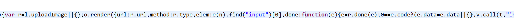

***

3. 在done后面的方法体内写入 r.done.call(e)，实现在layui处理之前重制返回信息。

### echarts实时动态渲染数据

效果：

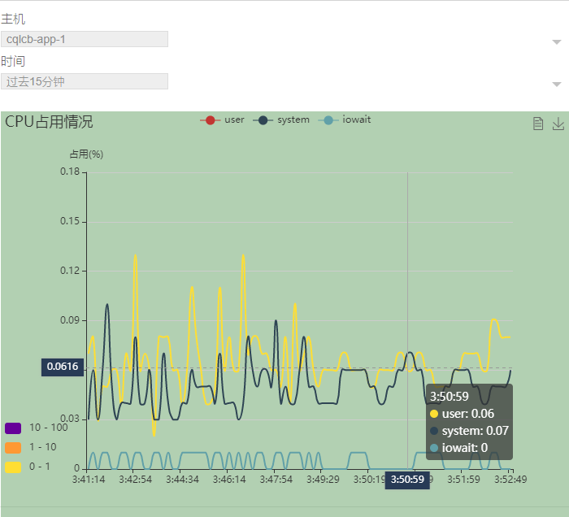

```html
<div class="cpu-statistic-div">
    <div class="cpu-data-div" id="<portlet:namespace/>container" >
    </div>
</div>
```

```js
<script type="text/javascript">
var dom = document.getElementById("<portlet:namespace/>container");
var myChart = echarts.init(dom);
var historyData = {};
var historyNumber;
var interval;
var option;
var hisDataurl="/api/jsonws/system-management-portlet.systemmonitorhelper/get-cpu-history-msg?portletId=<%=portletDisplay.getId()%>"
var hostUrl="/api/jsonws/system-management-portlet.systemmonitorhelper/get-host-list?portletId=<%=portletDisplay.getId()%>"
var realtimeDataUrl="/api/jsonws/system-management-portlet.systemmonitorhelper/get-cpu-realtime-msg?portletId=<%=portletDisplay.getId()%>"
var <portlet:namespace/>host;	
$(function () {
	$.ajaxSettings.async = false;
	getHostList();
	var host = $('#<portlet:namespace/>host').val();
	loadCpuHistoryData(host,null);
	drawStatistic(host);
	$.ajaxSettings.async = true;
});


function drawStatistic(host){
	var dom = document.getElementById("<portlet:namespace/>container");
	var myChart = echarts.init(dom);

	//Dynamic histogram
	myChart.showLoading();

	//Define related configurations
	option = {
		backgroundColor:'rgba(0,100,0, 0.3)',
		// Define title
		title : {
			// Main title
			text : 'CPU占用情况',
			// Subheading
			subtext : '',
			// Title Color
			color : '#808080',
			// padding
			padding : 5
		},
		// Set prompt box component
		tooltip : {
			// Trigger type (data item, coordinate axis, no trigger) ['item ',' axis', 'none']
			trigger : 'axis',
			// Axis indicator
			axisPointer : {
				// Indicator type (line, shadow, cross) ['line ',' shadow ',' cross']
				type : 'cross',
				// Text label for the axis indicator.
				label : {
					// Axis indicator background color
					backgroundColor : '#283b56'
				}
			},
		},
		// Legend component
		legend : {
			// Legend type (default, scroll) ['plain ',' scroll ']
			type : 'plain',
			// Data array for Legend
			data : [ 'user','system','iowait']
		},
		// toolbar
		toolbox : {
			show : true,
			// Layout orientation (horizontal, vertical) ['horizontal ','vertical']
			orient : 'horizontal',
			// Configuration items of each tool
			feature : {
				// Data view tools
				dataView : {
					readOnly : false
				},
				// Configuration item restore
// 				restore : {},
				// Save as picture
				saveAsImage : {}
			}
		},
		// Data area scaling
		dataZoom : {
			show : false,
			start : 0,
			end : 100
		},
		grid : {
			top : '15%',
			left : '15%'
		},
		// x-axis in grid of rectangular coordinate system
		xAxis : [ {
			// Coordinate axis type (value axis: continuous value, category axis: discrete value, time axis: continuous time series data, pair axis: logarithmic data) ['value ',' category ',' time ',' log ']
			type : 'category',
			// Strategy of leaving space on both sides of coordinate axis (category axis is Boolean, non category axis is Array)
			boundaryGap : true,
			// Define the x-axis data name below
			data : (function() {
				// Load 10 time data items, each item is 20 seconds apart
				var now = new Date();
				var res = [];
				var len = historyNumber;
				while (len--) {
					// Format time
					res.unshift(now.toLocaleTimeString().replace(/^\D*/, ''));
					now = new Date(now - 10000);
				}
				return res;
			})()
		}, ],
		// y-axis in grid of rectangular coordinate system
		yAxis : [ {
			type : 'value',
			// Whether it is out of 0 value scale. (Booolean) when set to true, the coordinate scale does not force a zero scale. It is more useful in the scatter diagram of double numerical axis.
			scale : true,
			name : '占用(%)',
			// The boundaryGap will fail after Max and min are defined
// 			max : 100,
			min : 0,
			boundaryGap : [ 0.2, 0.2 ]
		}],
		// Chart data
		series : [{
			name : 'user',
			type : 'line',
			// Latest transaction price data
			data : historyData['user'],
			//平滑线
			smooth:true
			//去除拐点
			,symbol: 'none'
		},{
			name : 'system',
			type : 'line',
			// Latest transaction price data
			data : historyData['system'],
			smooth:true
			,symbol: 'none'
		},{
			name : 'iowait',
			type : 'line',
			// Latest transaction price data
			data : historyData['iowait'],
			smooth:true
			,symbol: 'none'
		}  ],
		visualMap : {
			type : 'piecewise',
			seriesIndex : 0,
			bottom : '10%',
			pieces : [ {
				gt : 0,
				lte : 1,
				color : '#ffde33'
			}, {
				gt : 1,
				lte : 10,
				color : '#ff9933'
			}, {
				gt : 10,
				lte : 100,
				color : '#660099'
			} ],
			outOfRange : {
				color : '#999'
			}
		}
	};

	//Draw table for the first time
	myChart.hideLoading();
	myChart.setOption(option);
	//Generate new data regularly
	interval = setInterval(function() {
		// Format time
		var axisData = (new Date()).toLocaleTimeString().replace(/^\D*/, '');
		// Get data item 
		getCpuRealTimeData(host);
		option.xAxis[0].data.shift();
		option.xAxis[0].data.push(axisData);
		myChart.setOption(option);
	}, 5000);
}
//插入历史数据
function loadCpuHistoryData(host,period){
	historyData={};
	historyNumber=0;
	$.get(hisDataurl,{hostName:host,period:period},function(result){
		if('{}'!=JSON.stringify(result)){
			
			var res=$.parseJSON(result);
			var usage_user = res.sql_1[0].datas;
			historyNumber=usage_user.length;
			var usage_system = res.sql_0[0].datas;
			var usage_iowait = res.sql_2[0].datas;
			debugger
			//usage_sys
			var sysArr=[];
			$.each(usage_system,function(i,v){
				if(v.hasOwnProperty('mean')){
					sysArr.unshift(v['mean']);
				}
			})
			historyData['system']=sysArr;
			//usage_user
			var userArr=[];
			$.each(usage_user,function(i,v){
				if(v.hasOwnProperty('mean')){
					userArr.unshift(v['mean']);
				}
			})
			historyData['user']=userArr;
			//usage_iowait
			var iowaitArr=[];
			$.each(usage_iowait,function(i,v){
				if(v.hasOwnProperty('mean')){
					iowaitArr.unshift(v['mean']);
				}
			})
			historyData['iowait']=iowaitArr;
		}
	});
}
//获取实时数据
function getCpuRealTimeData(host){
	$.get(realtimeDataUrl,{hostName:host},function(result){
		if('{}'!=JSON.stringify(result)){
			var res=$.parseJSON(result);
			var usage_user = res.sql_1[0].datas;
			historyNumber=usage_user.length;
			var usage_system = res.sql_0[0].datas;
			var usage_iowait = res.sql_2[0].datas;
			//usage_user
			var data0 = option.series[0].data;
			// Remove old data and generate new data
			data0.shift();
			var map1 = usage_user[0];
			if(map1.hasOwnProperty('mean')){
				data0.push(map1['mean']);
			}
			//usage_sys
			var data1 = option.series[1].data;
			data1.shift();
			var map2 = usage_system[0];
			if(map2.hasOwnProperty('mean')){
				data1.push(map2['mean']);
			}
			//usage_iowait
			var data2 = option.series[2].data;
			data2.shift();
			var map3 = usage_iowait[0];
			if(map3.hasOwnProperty('mean')){
				data2.push(map3['mean']);
			}
		}
	});
}

function getHostList(host,period){
	$.get(hostUrl,function(result){
		if('{}'!=JSON.stringify(result)){
			var res=$.parseJSON(result);
			var cpu_host= res.sql_0.cpu;
			$.each(cpu_host,function(i,v){
				if(i==0){
					<portlet:namespace/>host = v['value'];
					$('#<portlet:namespace/>host').append("<option value="+v['value']+" selected>"+v['value']+"</option>");
				}
				else{
					$('#<portlet:namespace/>host').append("<option value="+v['value']+">"+v['value']+"</option>");
				}
			})
			layui.form.render('select');
		}
	});
}
layui.form.on('select(hostAndTime)', function(data){
	if(interval){
		clearInterval(interval);
	}
	var host =$('#<portlet:namespace/>host').val();
	var period =$('#<portlet:namespace/>period').val();
	$.ajaxSettings.async = false;
	loadCpuHistoryData(host,period);
	drawStatistic(host);
	$.ajaxSettings.async = true;
	layui.form.render('select');
})
</script>
```

### js setInterval()和setTimeout()的区别

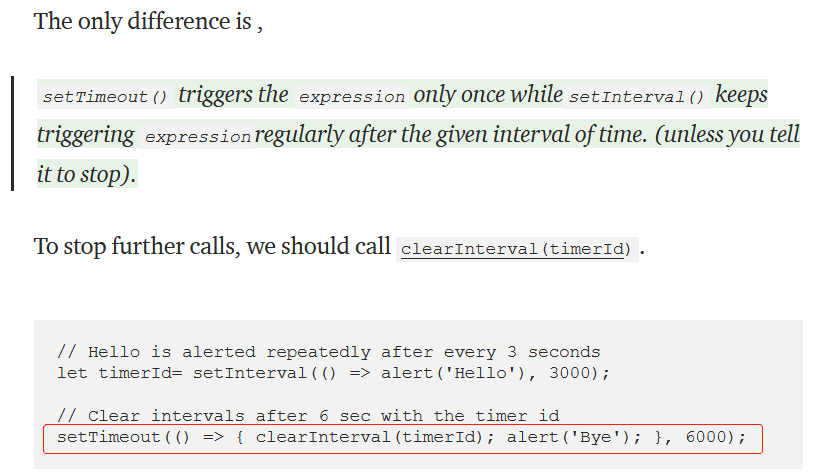


### js动态拼接变量名

**用对象的形式**      

```js
host="xxx";
varMap['dom'+host] = document.getElementById('id'+host);
varMap['chart'+host] = echarts.init(varMap['dom'+host]);
varMap['chart'+host].showLoading();
```

**用数组的形式**

```
var arr=[];
	for(var i=0;i<xxx.length;i++ )
	{
		arr[i]=
	}
```

### js取整数、取绝对值、取余数的方法

```js
// 丢弃小数部分,保留整数部分
parseInt(5/2)　　// 2
// 向上取整,有小数就整数部分加1
Math.ceil(5/2)　　// 3
// 四舍五入
Math.round(5/2)　　// 3
// 取余
6%4　　// 2
//取绝对值
Math.abs(-23) //23

```

### layui限制可选择时间范围

```js
//限制最长间隔时间为三个月
function <portlet:namespace/>downDateSelect(){
	layui.use(['laydate'], function(){
	    var laydate = layui.laydate;
	    var startTime = laydate.render({
	    	 elem: '#startDateInput'
    		 ,type: 'month'
	   		 ,done:function(value,date){
	             endTime.config.min={
	                     year:date.year,
	                     month:date.month-1,
	                     date:date.date,
	                 };
	                 endTime.config.max={
	                     year:date.year,
	                     month:date.month+1,
	                     date:date.date,
	                 };
	             }
	      });
	   var endTime = laydate.render({
	    	 elem: '#endDateInput'
    		 ,type: 'month'
	    	 ,done:function(value,date){
	             startTime.config.max={
	                     year:date.year,
	                     month:date.month-1,
	                     date:date.date,
	                 };
	                 startTime.config.min={
	                     year:date.year,
	                     month:date.month-3,
	                     date:date.date,
	                 };
	             }
	      });
	})
}
```

### js获取当前月的第一天和最后一天

```js
var firstDate = new Date();
firstDate.setDate(1); //第一天
var endDate = new Date(firstDate);
endDate.setMonth(firstDate.getMonth()+1);
endDate.setDate(0);
startDate = formatDate(new Date(firstDate));
endDate = formatDate(new Date(endDate));

//日期格式化为yyyy-MM-dd
function formatDate(date) {
	  var d = new Date(date),
      month = '' + (d.getMonth() + 1),
      day = '' + d.getDate(),
      year = d.getFullYear();
	  if (month.length < 2) month = '0' + month;
	  if (day.length < 2) day = '0' + day;
	  return [year, month, day].join('-');
	}

```

### js无链接下载页面数据

```js
const config = {
    name: 'lsqy',
    password: 'yourpassword',
    ak: 'XXXXXXXXXX',
    sk: 'XXXXXXXXXX'
}

const blobContent = new Blob(
    [JSON.stringify(config, null, 2)],
    {type : 'application/json'}
);

const blobUrl = window.URL.createObjectURL(blobContent)

downloadFileByBlob(blobUrl, 'config.json')

function downloadFileByBlob(blobUrl, filename) {
    const eleLink = document.createElement('a')
    eleLink.download = filename
    eleLink.style.display = 'none'
    eleLink.href = blobUrl
    // 触发点击
    document.body.appendChild(eleLink)
    eleLink.click()
    // 然后移除
    document.body.removeChild(eleLink)
}
```

### js实现超过字数“查看更多”

```html
<div class="inwraper3">
	 <span class="bargain-view-span1">备注: </span><span id="remark"></span> 	 
</div>
```

```js
view(data,table,form){
	var w = window.innerWidth * 0.8;
    var h = window.innerHeight * 0.8;
    var d=data;
    layer.open({
        type:1,
        anim: 2,
        title:"订单详情",
        scrollbar: false,
        area:[w +"px",h + "px"],
        btn:["返回"],
        content:$("#bargainWindow"),
        success:function () {
        	 readMore($("#<portlet:namespace/>remark"), data.remark);
         }
    });
}

//实现
function <portlet:namespace/>showMore(){ 
  var number = 100;
  var moreText="...查看更多";
  var box = document.getElementById("<portlet:namespace/>remark"); 
  var text = box.innerHTML; 
  var newBox = document.createElement("span"); 
  var btn = document.createElement("a"); 
  newBox.innerHTML = text.substring(0,number); 
  btn.innerHTML = text.length > number ? moreText : ""; 
  btn.href = "###"; 
  btn.onclick = function(){ 
    if(btn.innerHTML == moreText)
    { 
      btn.innerHTML = "收起"; 
      newBox.innerHTML =text; 
	  newBox.appendChild(btn);
    }
    else
    { 
      btn.innerHTML = moreText; 
      newBox.innerHTML = text.substring(0,number)
	   newBox.appendChild(btn);
    } 
  } 
  box.innerHTML = ""; 
  newBox.appendChild(btn);
  box.appendChild(newBox); 
} 

```

### jquery实现文本点击修改并保存

```html
<blockquote class="canChange" id="name"+proofs[i].paperId+">"+proofs[i].paperName</blockquote>
```

```js
$(function() {
	//获取class为canChange的元素
	$(".canChange").click(canChangeEleClick);
});

function canChangeEleClick(){
		var ele = $(this);
		var paperId =ele.attr("id").substr(4);
		var oldtxt = ele.text();
		var input = $("<input type='text'value='" + oldtxt + "'>");
		ele.html(input);
		input.click(function() {
			return false;
		});
		//获取焦点
		input.trigger("focus");
		//文本框失去焦点后提交内容，重新变为文本
		input.blur(function() {
		var newtxt = $(this).val();
		//判断文本有没有修改
		if (newtxt != oldtxt) {
				ele.html(newtxt);
				//数据库的修改就在一般处理程序中完成
				$.post(<portlet:namespace/>urlList.changeProofName,{paperId :paperId,newName :newtxt}, function(data) {
					debugger
				    try{ 
				        var res = JSON.parse(data);
				        if(res.stat){
				        	ele.html(newtxt);
				        }else{
				        	ele.html(oldtxt);
				        }
				        layer.msg(res.message);
				        return;
				      } catch(e) { 
				    	  layer.msg("修改失败！");
				    	  ele.html(oldtxt);
				      }
				});
			}else {
				ele.html(oldtxt);
			}
		});
	 }
```

### js捕获json解析异常

```js
$.post(url,{param1:'ddd'},function(data){
		try{ 
	        var res = JSON.parse(data);
	        if(res.stat){
	        	//......
	        }else{
	        	//.....
	        }
	      } catch(e) { 
	    	  //...
	      }
	});
```

### 动态画彩色小圆点

```css
	.circle {
		  height: 15px;
		  width: 15px;
		  border-radius: 50%;
		  display: inline-block;
		}
```

```js
$.each(res.datas, function (i, o) {
  				var item =o;
  				var hml="<tr><td><div style='text-align:left;'><span id ='dot"+i+"' class='circle'></span>"+item.outcomeName+"</div></td>";
	  				hml+="<td>"+(item.hasOwnProperty('tag1')?item.tag1:"")+"</td>";
	  				hml+="<td>"+(item.hasOwnProperty('tag2')?item.tag2:"")+"</td>";
	  				hml+="<td>"+(item.hasOwnProperty('tag3')?item.tag3:"")+"</td>";
	  				hml+="<td class='count'>"+(item.hasOwnProperty('count')?item.count:"")+"</td></tr>";
  				$('#<portlet:namespace/>databody').append(hml);
  				var c=getRandomColor();
  				$('#dot'+i).css("background-color",c);
  		 	});

function getRandomColor(){
	var r = Math.floor(Math.random()*255);
    var g = Math.floor(Math.random()*255);
    var b = Math.floor(Math.random()*255);
    var color = 'rgba('+ r +','+ g +','+ b +',0.8)';
    return color
}
```

效果：

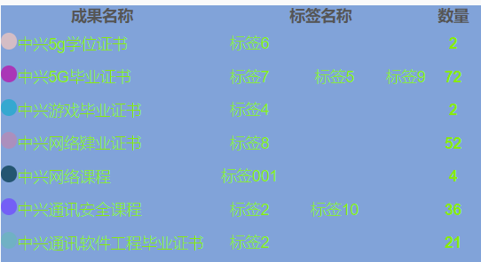

## 数据库

### join

sql的left join 、right join 、inner join之间的区别

*  -left join(左联接) 返回包括 左表中的所有记录和右表中联结字段相等的记录 
* -right join(右联接) 返回包括 右表中的所有记录和左表中联结字段相等的记录
* -inner join(等值连接) 只返回两个表中联结字段相等的行

### 合并行变成列

```sql
SELECT
 ch.outcomeId,
 ch.outcomeCode,
 ch.outcomeName,
 ch.outcomeTypeId,
 GROUP_CONCAT(
  ch.createdType,
  ":",
  ch.lableName
 ORDER BY
  ch.createdType DESC SEPARATOR ','
 ).........
```

**后台处理： **

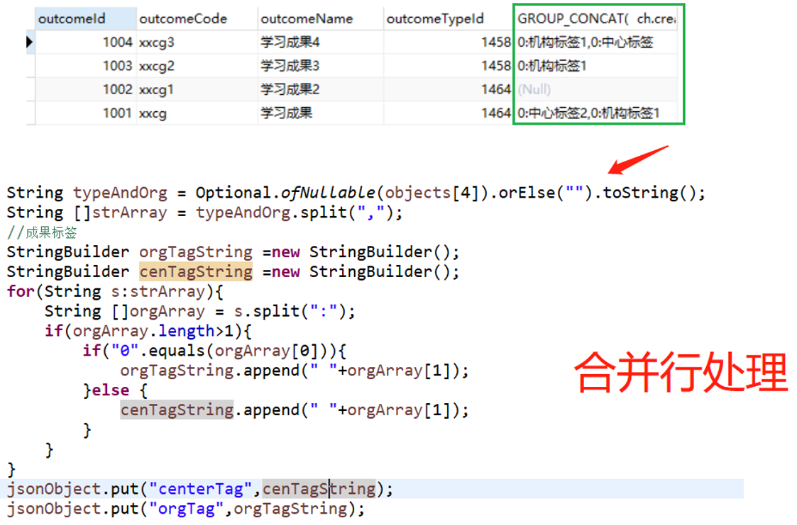

### 合并单列

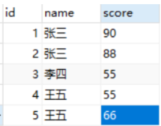

在Oracle中的实现把score这列转行并且用逗号拼接用listagg()实现如下：

listagg(score, ',') within group(ORDER BY )

而在MySQL下可以使用group_concar()来实现：

select `name`,group_concat(score separator ',') from test group by `name`

### 合并多列后前后端处理

* 数据样式：

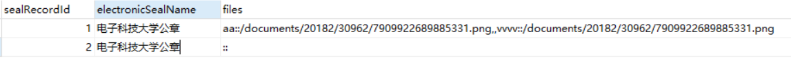

* 后端处理解析

```java
List<Map<String, Object>> datas = new ArrayList<>();
String fileCollect = objects[7].toString();
String []strArray = fileCollect.split(",,");
List<Map<String, String>> files=new ArrayList<>();
for(String s:strArray){
	String []fileAtt = s.split("::");
	if(fileAtt.length>0){
		Map<String, String> fileAttribute = new HashMap<String, String>();
		fileAttribute.put("fileName", fileAtt[0]);
		fileAttribute.put("fileUrl", fileAtt[1]);
		files.add(fileAttribute);
		}
	}
map.put("beforeSealFiles", files);
```

* 前端将每个文件的地址制作成可点击预览。效果：

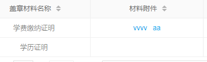

* 实现(基于layui)：

**表格：**

```js
 ,{title : '材料附件',sort:true,align:'center',field:'beforeSealFileUrl',templet: addLink}
```

**js拼接链接及实现点击预览：**

```js
function addLink(d) {
	
	var files = d.beforeSealFiles;
	var links ="";
	$.each(files,function(index,value){
		if(""==links){
			links = '<a class="layui-table-link" href="javascript:void(0);" value ='+value.fileUrl+' onclick="preview(this)">' + value.fileName+ '</a>';
		}else{
			links = links+ '&nbsp&nbsp&nbsp<a class="layui-table-link" href="javascript:void(0);"value ='+value.fileUrl+' onclick="preview(this)">' + value.fileName+ '</a>';
		}
	})
	return links;
} 
function preview(d){
	var url = $(d).attr("value");
	layui.use('layer',function(){
		var layer = layui.layer;
		layer.open({
			type : 2,
			title:d.beforeSealFileName,
			area : ['900px','700px'],
			fixed :false,
			maxmin : true,
			content : url
		});
	});
}
```

### mysql反向in查询

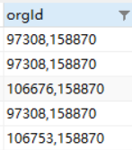

```sql
SELECT outcomeName FROM cb_outcome  WHERE find_in_set(158870,orgId) 
```

* 进阶

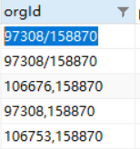

```sql
SELECT outcomeName FROM cb_outcome  WHERE find_in_set(158870,replace(orgId, '/', ',')) 
```


### Hibernate或查询：

```java
或 or查询：

//可以根据证书编号或者证明的在线验证码查询
  Junction junction = RestrictionsFactoryUtil.disjunction();
  junction.add(PropertyFactoryUtil.forName("paperNumber").eq(paperNumber));
  junction.add(PropertyFactoryUtil.forName("onlineCheckCode").eq(paperNumber));
  dynamicQuery.add(junction);
```

### mysql时间段查询

```sql
### 查询当天
select * from 表名 where to_days(时间字段名) = to_days(now());
select * from 表名 where date(时间字段名) = curdate();
### 查询昨天
select * from 表名  WHERE TO_DAYS( NOW( ) ) - TO_DAYS( 时间字段名) = 1
### 查询近七天
SELECT * FROM 表名 where DATE_SUB(CURDATE(), INTERVAL 7 DAY) <= date(时间字段名)
### 查询上一个月
select * from 表名 WHERE PERIOD_DIFF( date_format( now( ) , '%Y%m' ) , date_format( 时间字段名, '%Y%m' ) ) =1
### 查询本月
SELECT * FROM 表名 WHERE DATE_FORMAT( 时间字段名, '%Y%m' ) = DATE_FORMAT( CURDATE( ) , '%Y%m' )
###查询当前这周的数据
SELECT * FROM 表名 WHERE YEARWEEK(date_format(时间字段名,'%Y-%m-%d')) = YEARWEEK(now());
###查询上周的数据
SELECT * FROM 表名 WHERE YEARWEEK(date_format(时间字段名,'%Y-%m-%d')) = YEARWEEK(now())-1;
###查询本季度数据
select * from 表名 where QUARTER(时间字段名)=QUARTER(now());
###查询上季度数据
select * from 表名 where QUARTER(时间字段名)=QUARTER(DATE_SUB(now(),interval 1 QUARTER));
###查询本年数据
select * from 表名 where YEAR(时间字段名)=YEAR(NOW());
###查询上年数据
select * from 表名 where year(时间字段名)=year(date_sub(now(),interval 1 year));
###查询当前这周的数据
SELECT * FROM 表名 WHERE YEARWEEK(date_format(时间字段名,'%Y-%m-%d')) = YEARWEEK(now());
```


## Linux

### 创建定时任务步骤

以定时备份数据和备份文件夹库为例：

* 1. vim database_backup.sh;

```shell
#!/bin/bash
DATE=$(date +%Y%m%d)
DATE_RM=$(date -d "7 days ago" +%Y%m%d)
IP_ADDRESS=192.168.190.17
USER=root
PASSWD=root
mysqldump --opt --column-statistics=0 -h$IP_ADDRESS --user=$USER --password=$PASSWD --lock-all-tables=true --result-file=/home/hwadee/$(date +%Y%m%d)-databackup.sql --default-character-set=utf8 cqlcb
```

备份文件夹：

```sh
#!/bin/bash
DATE=$(date +%Y%m%d)
DATE_RM=$(date -d "7 days ago" +%Y%m%d)
tar -zcPvf /home/backup/liferay-portal-6.2-ce-ga5_$(date +%Y%m%d).tar   					/opt/module/liferay-portal-6.2-ce-ga5/
rm -rf /home/backup/liferay-portal-6.2-ce-ga5_$DATE_RM.tar
```

* 2. sudo chmod 777 database_backup.sh;
* 3. sudo crontab -e;

```shell
# For more information see the manual pages of crontab(5) and cron(8)
# 
# m h  dom mon dow   command

0 14 * * * sh /home/backup/backup_full.sh#每天14：00执行
10 15 * * * sh /home/backup/database_backup.sh#每天15：10执行                                           
```

* 4. sudo service cron restart;

# 工具

## powerDesigner

### 表格导出为Excel

```vbscript
'******************************************************************************
Option Explicit
   Dim rowsNum
   rowsNum = 0
'-----------------------------------------------------------------------------
' Main function
'-----------------------------------------------------------------------------
' Get the current active model
    Dim Model
    Set Model = ActiveModel
    If (Model Is Nothing) Or (Not Model.IsKindOf(PdPDM.cls_Model)) Then
       MsgBox "The current model is not an PDM model."
    Else
      ' Get the tables collection
      '创建EXCEL APP
      dim beginrow
      DIM EXCEL, SHEET, SHEETLIST
      set EXCEL = CREATEOBJECT("Excel.Application")
      EXCEL.workbooks.add(-4167)'添加工作表
      EXCEL.workbooks(1).sheets(1).name ="表结构"
      set SHEET = EXCEL.workbooks(1).sheets("表结构")
       
      EXCEL.workbooks(1).sheets.add
      EXCEL.workbooks(1).sheets(1).name ="目录"
      set SHEETLIST = EXCEL.workbooks(1).sheets("目录")
      ShowTableList Model,SHEETLIST
 
      ShowProperties Model, SHEET,SHEETLIST
       
       
      EXCEL.workbooks(1).Sheets(2).Select
      EXCEL.visible = true
      '设置列宽和自动换行
      sheet.Columns(1).ColumnWidth = 20
      sheet.Columns(2).ColumnWidth = 20
      sheet.Columns(3).ColumnWidth = 20
      sheet.Columns(4).ColumnWidth = 40
      sheet.Columns(5).ColumnWidth = 10
      sheet.Columns(6).ColumnWidth = 10
      sheet.Columns(1).WrapText =true
      sheet.Columns(2).WrapText =true
      sheet.Columns(4).WrapText =true
      '不显示网格线
      EXCEL.ActiveWindow.DisplayGridlines = False
       
       
 End If
'-----------------------------------------------------------------------------
' Show properties of tables
'-----------------------------------------------------------------------------
Sub ShowProperties(mdl, sheet,SheetList)
   ' Show tables of the current model/package
   rowsNum=0
   beginrow = rowsNum+1
   Dim rowIndex
   rowIndex=3
   ' For each table
   output "begin"
   Dim tab
   For Each tab In mdl.tables
      ShowTable tab,sheet,rowIndex,sheetList
      rowIndex = rowIndex +1
   Next
   if mdl.tables.count > 0 then
        sheet.Range("A" & beginrow + 1 & ":A" & rowsNum).Rows.Group
   end if
   output "end"
End Sub
'-----------------------------------------------------------------------------
' Show table properties
'-----------------------------------------------------------------------------
Sub ShowTable(tab, sheet,rowIndex,sheetList)
   If IsObject(tab) Then
     Dim rangFlag
     rowsNum = rowsNum + 1
      ' Show properties
      Output "================================"
      sheet.cells(rowsNum, 1) =tab.name
      sheet.cells(rowsNum, 1).HorizontalAlignment=3
      sheet.cells(rowsNum, 2) = tab.code
      'sheet.cells(rowsNum, 5).HorizontalAlignment=3
      'sheet.cells(rowsNum, 6) = ""
      'sheet.cells(rowsNum, 7) = "表说明"
      sheet.cells(rowsNum, 3) = tab.comment
      'sheet.cells(rowsNum, 8).HorizontalAlignment=3
      sheet.Range(sheet.cells(rowsNum, 3),sheet.cells(rowsNum, 7)).Merge
      '设置超链接，从目录点击表名去查看表结构
      '字段中文名    字段英文名    字段类型    注释    是否主键    是否非空    默认值
      sheetList.Hyperlinks.Add sheetList.cells(rowIndex,2), "","表结构"&"!B"&rowsNum
      rowsNum = rowsNum + 1
      sheet.cells(rowsNum, 1) = "字段中文名"
      sheet.cells(rowsNum, 2) = "字段英文名"
      sheet.cells(rowsNum, 3) = "字段类型"
      sheet.cells(rowsNum, 4) = "注释"
      sheet.cells(rowsNum, 5) = "是否主键"
      sheet.cells(rowsNum, 6) = "是否非空"
      sheet.cells(rowsNum, 7) = "默认值"
      '设置边框
      sheet.Range(sheet.cells(rowsNum-1, 1),sheet.cells(rowsNum, 7)).Borders.LineStyle = "1"
      'sheet.Range(sheet.cells(rowsNum-1, 4),sheet.cells(rowsNum, 9)).Borders.LineStyle = "1"
      '字体为10号
      sheet.Range(sheet.cells(rowsNum-1, 1),sheet.cells(rowsNum, 7)).Font.Size=10
            Dim col ' running column
            Dim colsNum
            colsNum = 0
      for each col in tab.columns
        rowsNum = rowsNum + 1
        colsNum = colsNum + 1
          sheet.cells(rowsNum, 1) = col.name
        'sheet.cells(rowsNum, 3) = ""
          'sheet.cells(rowsNum, 4) = col.name
          sheet.cells(rowsNum, 2) = col.code
          sheet.cells(rowsNum, 3) = col.datatype
        sheet.cells(rowsNum, 4) = col.comment
          If col.Primary = true Then
        sheet.cells(rowsNum, 5) = "Y"
        Else
        sheet.cells(rowsNum, 5) = " "
        End If
        If col.Mandatory = true Then
        sheet.cells(rowsNum, 6) = "Y"
        Else
        sheet.cells(rowsNum, 6) = " "
        End If
        sheet.cells(rowsNum, 7) =  col.defaultvalue
      next
      sheet.Range(sheet.cells(rowsNum-colsNum+1,1),sheet.cells(rowsNum,7)).Borders.LineStyle = "3"      
      'sheet.Range(sheet.cells(rowsNum-colsNum+1,4),sheet.cells(rowsNum,9)).Borders.LineStyle = "3"
      sheet.Range(sheet.cells(rowsNum-colsNum+1,1),sheet.cells(rowsNum,7)).Font.Size = 10
      rowsNum = rowsNum + 2
       
      Output "FullDescription: "       + tab.Name
   End If
    
End Sub
'-----------------------------------------------------------------------------
' Show List Of Table
'-----------------------------------------------------------------------------
Sub ShowTableList(mdl, SheetList)
   ' Show tables of the current model/package
   Dim rowsNo
   rowsNo=1
   ' For each table
   output "begin"
   SheetList.cells(rowsNo, 1) = "主题"
   SheetList.cells(rowsNo, 2) = "表中文名"
   SheetList.cells(rowsNo, 3) = "表英文名"
   SheetList.cells(rowsNo, 4) = "表说明"
   rowsNo = rowsNo + 1
   SheetList.cells(rowsNo, 1) = mdl.name
   Dim tab
   For Each tab In mdl.tables
     If IsObject(tab) Then
         rowsNo = rowsNo + 1
      SheetList.cells(rowsNo, 1) = ""
      SheetList.cells(rowsNo, 2) = tab.name
      SheetList.cells(rowsNo, 3) = tab.code
      SheetList.cells(rowsNo, 4) = tab.comment
     End If
   Next
    SheetList.Columns(1).ColumnWidth = 20
      SheetList.Columns(2).ColumnWidth = 20
      SheetList.Columns(3).ColumnWidth = 30
     SheetList.Columns(4).ColumnWidth = 60
   output "end"
End Sub
```

### 使name列等于comment列

```vbscript
Option   Explicit
ValidationMode   =   True
InteractiveMode   =   im_Batch
 
Dim   mdl   '   the   current   model
 
'   get   the   current   active   model
Set   mdl   =   ActiveModel
If   (mdl   Is   Nothing)   Then
      MsgBox   "There   is   no   current   Model "
ElseIf   Not   mdl.IsKindOf(PdPDM.cls_Model)   Then
      MsgBox   "The   current   model   is   not   an   Physical   Data   model. "
Else
      ProcessFolder   mdl
End   If
 
Private   sub   ProcessFolder(folder)
On Error Resume Next
      Dim   Tab   'running     table
      for   each   Tab   in   folder.tables
            if   not   tab.isShortcut   then
                  tab.name   =    tab.comment 
                  Dim   col   '   running   column
                  for   each   col   in   tab.columns
                  if col.comment="" then
                  else
                        col.name= col.comment 
                  end if
                  next
            end   if
      next
      Dim   view   'running   view
      for   each   view   in   folder.Views
            if   not   view.isShortcut   then
                  view.name   =   view.code + "(" + view.comment + ")"
            end   if
      next
 
      '   go   into   the   sub-packages
      Dim   f   '   running   folder
      For   Each   f   In   folder.Packages
            if   not   f.IsShortcut   then
                  ProcessFolder   f
            end   if
      Next
end   sub
```

### comment列等于name列

```vbscript
Option   Explicit
ValidationMode   =   True
InteractiveMode   =   im_Batch
 
Dim   mdl   '   the   current   model
 
'   get   the   current   active   model
Set   mdl   =   ActiveModel
If   (mdl   Is   Nothing)   Then
      MsgBox   "There   is   no   current   Model "
ElseIf   Not   mdl.IsKindOf(PdPDM.cls_Model)   Then
      MsgBox   "The   current   model   is   not   an   Physical   Data   model. "
Else
      ProcessFolder   mdl
End   If
 
Private   sub   ProcessFolder(folder)
On Error Resume Next
      Dim   Tab   'running     table
      for   each   Tab   in   folder.tables
            if   not   tab.isShortcut   then
                  tab.comment   =    tab.name 
                  Dim   col   '   running   column
                  for   each   col   in   tab.columns
                  if col.name="" then
                  else
                        col.comment= col.name 
                  end if
                  next
            end   if
      next
end   sub
```

## 错误记录

### $(function () {})、window.onload=function(){}、$(document).ready(function{})触发两次的错误

**解决：**把form表单里的触发button 的type由“submit”改成“button”，或者把按钮点击事件改成监听

**解答来源：**

That is because the default action of the `` element is to submit the form. Basically you are executing `main()` **and reloading the page**: this causes the `$(document).ready(...)` event to fire again. You can simply call `event.preventDefault` in the button function, or use `` to override form submission behavior.

The simplest solution:

```js
<button onclick="main()" class="btn btn-default" type="button">Submit</button>
```

Otherwise, you will have to capture the event and prevent default behavior, i.e.:

```js
function main(e) {
    e.preventDefault()
    // Rest of the code here
}
```

With regards to the second solution: it is always better to attach  event handlers to elements instead of using inline JS. We can give your  button an ID:

```js
<button id="submitButton" class="btn btn-default">Submit</button>
```

And then simply attach the click event listener to it:

```js
$(document).ready(function() {
    $('tbody tr').each(function() {
        var TestPlatform = $(this).find('td.Affected').text(); //Affected Test Platforms
        aquireTestPlatforms(TestPlatform);
    });
    addTestPlatformsToSelector();

    $('#submitButton').on('click', function(e) {
        e.preventDefault();

        // All of main() code can go in here
    });
});
```

## Echarts

定制提示

```js
tooltip : {
    trigger : 'axis',
        axisPointer : {
            type : 'cross',
                label : {
                    backgroundColor : '#283b56'
                        ,formatter:function (params) {
                            var value=params.value;
                            if(typeof value == 'number'){
                                return transValue(value);
                            }else{
                                return value;
                            }
                        }
                }
        },
            formatter: function (params) {
                var str = params[0].name + '<br>';
                for(var item of params){
                    var value = Math.abs(item.data);
                    var f = transValue(value);
                    str +=
                        "<span style='display:inline-block;margin-right:5px;border-radius:50%;width:10px;height:10px;left:5px;background-color:"+item.color+"'></span>" + item.seriesName + " : " + f + "<br>";
                }
                return str;
            },
},
```

效果：

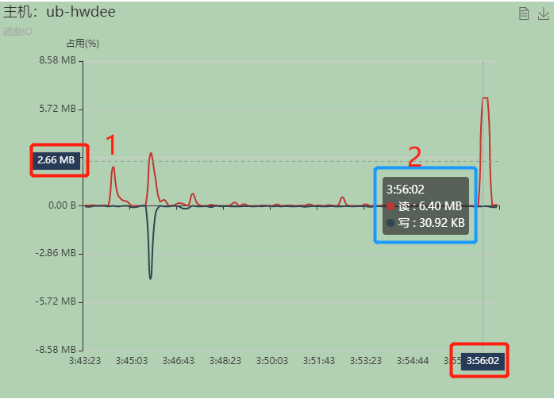

### 双y轴

1. 

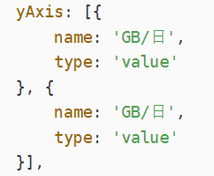

2. series里指定索引

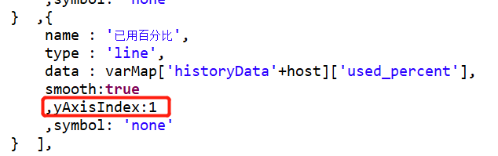

## 其他

### windows查看端口占用，杀死进程

* 查看端口占用：
netstat -ano |findstr “端口号” 
* 杀死进程：
taskkill /f /t /im “进程id”
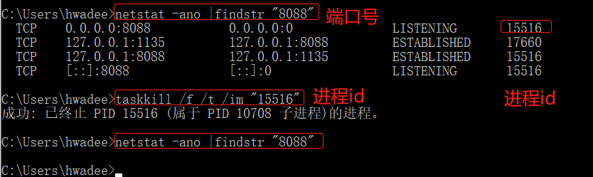

### XShell连接linux 上传下载文件到本地

* sz 下载文件到windows本地
* rz 上传windows文件到linux