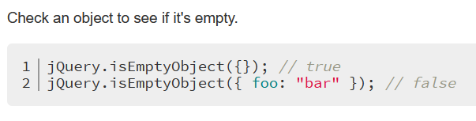
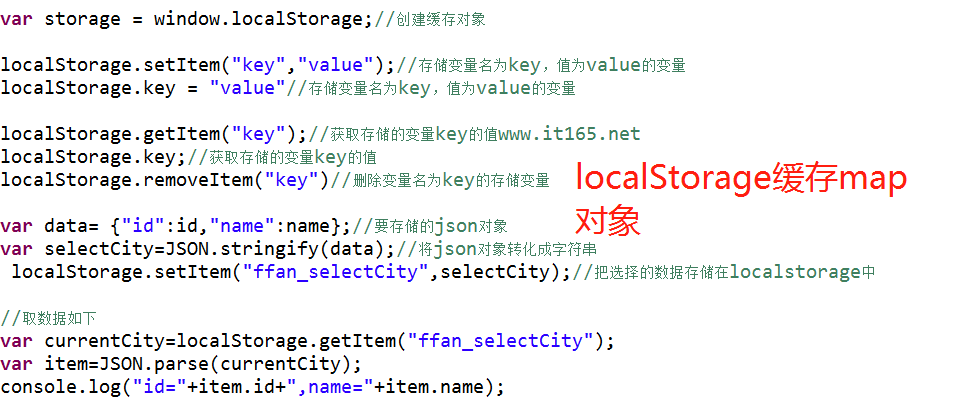

# 华迪笔记

## Java

### Java实现Date和Timestamp的相互转换

```java
Timestamp createTime = new Timestamp(new Date().getTime());
//Timestamp转Date
Timestamp t = new Timestamp(System.currentTimeMillis());
Date d = new Date(t.getTime());
```

### list中存放map，根据map中的某个key去重:

```java
List<Map<String, String>> list =new ArrayList<Map<String, String>>();

Map<String, String> data=new LinkedHashMap<String, String>();
........
{
 data.put("userId", Optional.ofNullable(objects[0]).orElse("").toString());
 data.put("userName", Optional.ofNullable(objects[1]).orElse("").toString());
 data.put("phone", Optional.ofNullable(objects[2]).orElse("").toString());
 data.put("orgName", Optional.ofNullable(objects[3]).orElse("").toString());
 list.add(data);
}
....
list.stream().collect(Collectors.collectingAndThen(Collectors.toCollection(
            () -> new TreeSet<>(Comparator.comparing(
   m -> ((Map<String, String>)m).get("userId")))), ArrayList::new));
```

### hibernate两次查询会出现的问题


***

### hibernate not in（）查询

```java
public DataResult<JSONArray> getOrganizationByCondition(String accreditedOrgIds){
    //accreditedOrgIds是前端传回来的id数组
		if(Validator.isNotNull(accreditedOrgIds)){
			DynamicQuery subDynamicQuery = OrganizationLocalServiceUtil.dynamicQuery();
			subDynamicQuery.setProjection(ProjectionFactoryUtil.property("organizationId"));
			subDynamicQuery.add(PropertyFactoryUtil.forName("organizationId").in(JSONArray.parseArray(accreditedOrgIds, Long.class)));
			dynamicQuery.add(PropertyFactoryUtil.forName("organizationId").notIn(subDynamicQuery));
			countQuery.add(PropertyFactoryUtil.forName("organizationId").notIn(subDynamicQuery));
		}
	
	}
	
```

### 判断是否为小数，是则保留小数点后两位

```java
private Object dealValue(Object val){
        try {
           double dNumber = Double.parseDouble(val.toString());
            BigDecimal bg = new BigDecimal(dNumber);
            double rNumber = bg.setScale(2, BigDecimal.ROUND_HALF_UP).doubleValue();
            return rNumber;
        } catch(NumberFormatException e){
            return val;
        }
    }
```


### 将List集合中的对象的某个属性提取出来组成List

```java
List<ElectronicSeal> electronicSeals = ElectronicSealLocalServiceUtil.dynamicQuery(query);
List<Map<String, Object>> datas = electronicSeals.stream().map(ElectronicSeal::getModelAttributes).collect(Collectors.toList());

```

* 进阶：获取多个属性或者按条件过滤

```java
List<PersonDo> list=new ArrayList<>();
    list.add(new PersonDo("藏三",17,"男",167L,60L));
    list.add(new PersonDo("李肆",18,"未知",180L,100L));
    list.add(new PersonDo("王武",19,"女",172L,55L));


    List<String> nameList = list.stream().map(PersonDo::getName).collect(Collectors.toList());
    System.out.println("只获取一个元素：————————");
    for (String name:nameList) {
        System.out.println(name);
    }
    System.out.println();

    Map<String, Integer> nameAndAgeList = list.stream().collect(Collectors.toMap(PersonDo::getName, PersonDo::getAge));
    System.out.println("获取两个元素：————————");
    for (Map.Entry<String, Integer> map:nameAndAgeList.entrySet()) {
        System.out.println(map.getKey()+","+map.getValue());
    }
    System.out.println();

    List<PersonDo> personDoList = list.stream().filter(man -> "王武".equals(man.getName())).collect(Collectors.toList());
    System.out.println("条件过滤：————————");
    for (PersonDo p:personDoList) {
        System.out.println(p.toString());
    }
    System.out.println();

    Map<String, Integer> nameAndAgeWithFileByName = list.stream().filter(man -> "藏三".equals(man.getName())).collect(Collectors.toMap(PersonDo::getName, PersonDo::getAge));
    System.out.println("条件过滤+部分属性：————————");
    for (Map.Entry<String, Integer> map:nameAndAgeWithFileByName.entrySet()) {
        System.out.println(map.getKey()+","+map.getValue());
    }

```

### java代码中执行系统命令

在java中，RunTime.getRuntime().exec()实现了调用服务器命令脚本来执行功能需要。

如果我们想在500秒后使电脑关机，通过Runtime.getRuntime().exec()我们可以这样写:

```java
//添加一个60S后自动关闭计算机的计划。
Runtime.getRuntime().exec(shutdown -s -t 500);
```

**两个例子：**

1. 备份mysql数据库：

```java
/**数据库备份成sql文件
	 * mysqldump --opt --column-statistics=0 -h192.168.190.11 --user=root --			password=Root2021@ 
	 * --lock-all-tables=true --result-file=/home/hwadee/2021-08-24-databackup.sql 
	 * --default-character-set=utf8 cqlcb
	 *其中cqlcb为数据库名
	 */
	public  boolean backupDatabaseToSQL() {
	String url = PropsUtil.get(PropsKeys.JDBC_DEFAULT_URL);
	String cleanURI = url.substring(5);
	URI uri = URI.create(cleanURI);
	String hostIP=uri.getHost();
	String databaseName=uri.getPath().substring(1);
	String password = PropsUtil.get( PropsKeys.JDBC_DEFAULT_PASSWORD);
	String userName = PropsUtil.get(PropsKeys.JDBC_DEFAULT_USERNAME);
	
	String savePath =DataBackupConstant.DATABASE_BACKUP_PATH;
	String fileName = DataBackupConstant.getDatabaseBackupTargetPath();
	File saveFile = new File(savePath);

	if (!saveFile.exists()) {// 如果目录不存在
		saveFile.mkdirs();// 创建文件夹
	}
	if (!savePath.endsWith(File.separator)) {
		savePath = savePath + File.separator;
	}
	PrintWriter printWriter = null;
	BufferedReader bufferedReader = null;

	try {
		printWriter = new PrintWriter(new OutputStreamWriter(new FileOutputStream(savePath + fileName), "utf8"));
		StringBuilder stringBuilder = new StringBuilder();
		stringBuilder.append("mysqldump").append(" --opt").append(" -h").append(hostIP);
		stringBuilder.append(" --user=").append(userName).append(" --password=").append(password)
		.append(" --lock-tables=true");
		stringBuilder.append(" --result-file=").append(savePath + fileName).append(" --default-character-set=utf8 ")
		.append(databaseName);
		Process process = Runtime.getRuntime().exec(stringBuilder.toString());
		InputStreamReader inputStreamReader = new InputStreamReader(process.getInputStream(), "utf8");
		bufferedReader = new BufferedReader(inputStreamReader);
		String line;
		while ((line = bufferedReader.readLine()) != null) {
		printWriter.println(line);
	
		}
		printWriter.flush();
	
		if (process.waitFor() == 0) {// 0 表示线程正常终止。
			return true;
		}

	} catch (IOException | InterruptedException) {
		e.printStackTrace();
	} finally {
		try {
			if (bufferedReader != null) {
				bufferedReader.close();
			}
			if (printWriter != null) {
				printWriter.close();
			}
		} catch (IOException e) {
			e.printStackTrace();
		}
	}	
	return false;

	}
```

2. 备份系统中的文件夹：

windows:

```java
public boolean backupFolder() {
		try {
			String location = "E:\\project\\"; //File path you are getting from file chooser
			String target = "F:\\backup\\";
			File locFile = new File(target);
			File tarFile = new File(target);
			copyDirectory(locFile, tarFile);
			return true;
		} catch (IOException ex) {
			ex.printStackTrace();
		}
		return false;
		
	}
	public void copy(File sourceLocation, File targetLocation) throws IOException {
        if (sourceLocation.isDirectory()) {
            copyDirectory(sourceLocation, targetLocation);
        } else {
            copyFile(sourceLocation, targetLocation);
        }
    }
    private void copyDirectory(File source, File target) throws IOException {
        if (!target.exists()) {
            target.mkdir();
        }

        for (String f : source.list()) {
            copy(new File(source, f), new File(target, f));
        }
    }

    private void copyFile(File source, File target) throws IOException {
        try (
                InputStream in = new FileInputStream(source);
                OutputStream out = new FileOutputStream(target)) {
            byte[] buf = new byte[1024];
            int length;
            while ((length = in.read(buf)) > 0) {
                out.write(buf, 0, length);
            }
        }
    }

```

linux:

```java
public boolean backupWebFolder() {
        try {
            SimpleDateFormat sdf = new SimpleDateFormat("yyyyMMDD");
            Date date=new Date();
            StringBuilder stringBuilder =new StringBuilder();
            String tempString = DataBackupConstant.WEB_BACKUP_TARGET_FOLDER.substring(0,DataBackupConstant.WEB_BACKUP_TARGET_FOLDER.length()-2);
            String partFileName = tempString.substring(tempString.lastIndexOf("/"));
            stringBuilder.append("tar -zcPvf ").append(DataBackupConstant.WEB_BACKUP_TARGET_FOLDER).append(partFileName)
            .append(sdf.format(date)).append(".tar  ")
            .append(DataBackupConstant.WEB_FOLDER_LOCATION);
            Process process = Runtime.getRuntime().exec(stringBuilder.toString());
            if (process.waitFor() == 0) {// 0 表示线程正常终止。
            	
            	return true;
            }
        } catch (IOException | InterruptedException ex) {
            ex.printStackTrace();
        }
		return false;
        
    }
```


## 前端

```javascript
/* 限制输入为正整数 */
		 $(":text").keyup(function(){
			
			$(this)[0].value=$(this)[0].value.replace(/^(0+)|[^\d]+/g,'');
		}) 
```

```js
//jquery给span赋值
$("#spanid").html(value)

//取值
$("#spanid").text()
```

### 禁用与恢复按钮

```javascript
$('#sendSmsBtn').addClass("layui-btn-disabled").attr("disabled",true);

$('#sendSmsBtn').removeClass("layui-btn-disabled").attr("disabled",false);
```


### js中”===“和”==“的区别

”===“需要类型一致才为true，”==“则不需要。（比如int和String值比较）

```javascript
<script type="text/html" id="bar">
    <!-- 兑换按钮 -->
	{{#  if(d.status == 1){ }}
    <button type="button" class="layui-btn layui-btn-sm" lay-event="release" title="兑换">
       	兑换
    </button>
 	{{#  }}}
</script>
```

### jQuery设置与判空

```javascript
    if (!$("#myTextArea").val()) {
        // textarea is empty
    }

    if (!$.trim($("#myTextArea").val())) {
        // textarea is empty or contains only white-space
    }
//清空输入信息
$("#auditOpinion").val('');
```

### layui弹窗确认

```javascript
	layer.confirm("提示信息",{
		btn: ['按钮1', '按钮2']
	}, function () {
		// 按钮1的事件
	}, function(){
		// 按钮2的事件
	});
```

### input输入框定制(最小输入长度)数据校验

1.html
```html
<input type="text" id="templateTitle" name="templateTitle" onblur=" minVerify(this.value)" maxlength="30" minlength="4">
```
2.js

```js
function minVerify(object){
	var dom=object;
	var value =(dom.value).trim();
	var min = dom.getAttribute('minlength');
    if(value.length < min){
       layui.layer.msg('长度不能小于'+min+'个字符');
       document.getElementById(dom.id).focus();
    }
}
```

### 前端校验输入是否为身份证号 电话号码 邮箱：

```js
//验证是否为手机号或者座机号码
 function isTelCode(str) {
  var reg=/(^(?:(?:0\d{2,3})-)?(?:\d{7,8})(-(?:\d{3,}))?$)|(^0{0,1}1[3|4|5|6|7|8|9][0-9]{9}$)/;
  return reg.test(str);
 }
 
 /*校验正整数*/
 function isPositiveNum(str) {
  var reg= /[1-9]+\d*/;
  return reg.test(str);
 }
 /*校验邮件地址是否合法 */
 function isEmail(str) {
  var reg=/^([a-zA-Z0-9_-])+@([a-zA-Z0-9_-])+(.[a-zA-Z0-9_-])+/;
  return reg.test(str);
 }
 /*校验身份证号是否合法 */
 function isEmail(str) {
  var reg=/(^\d{15}$)|(^\d{18}$)|(^\d{17}(\d|X|x)$)/; 
  return reg.test(str);
 }
 $("#creatorContact").on('blur',function(){
  if(!isTelCode($("#creatorContact").val()) && !isEmail($("#creatorContact").val())){//creatorContact为input框id
    layui.layer.msg("只能留邮箱或者电话");
    document.getElementById("creatorContact").focus();//鼠标回到框中
    
    return false;
  }
    })
```

### 校验正整数

* 输入框

```html
<input type="text"  id="age" name="age" onblur=" numVerify(this)" placeholder="请输入" maxlength="150" minlength="1"  >
```

* js校验

```js
/*校验正整数 */
function numVerify(object){
	var dom=object;
	var value =(dom.value).trim();
	var min = dom.getAttribute('minlength');
	var max = dom.getAttribute('maxlength');
	eval("var reg = /\^[1-9]\\d{" + min+","+(max-1) + "\}$/;");
    var reg = new RegExp(reg);
// 	var reg = /\^[1-9]\\d{" + min+","+(max-1) + "\}$/;
    if(!reg.test(value)){
       layui.layer.msg('只能输入不小于'+min+'、不大于'+max+'的整数');
       document.getElementById(dom.id).focus();
    }
}
```


### jquery遍历下拉框，并将指定值设置为已选中：

```js
var selectorPT = $("select[name=platformTypeSelector]"); //从A1下拉框中 搜索值
            $(selectorPT).children("option").each(function () {
                //console.log(this.index);
                //console.log($(this).text());//每一个option
                var aaa= data.platformTypeName;
                var bbb= $(this).text();
                debugger
                if ($(this).text() === data.platformTypeName) {
                    $("select[name=platformTypeSelector]").find('option:eq('+this.index+')').attr('selected', true);
                }
            });
```

### Jquery 给 select 下拉框赋值

```js
$("#poet").find("option:contains('李白')").attr("selected",true);  
//使用 “option[text='李白']” 这种写法是错误的
$("#poet").find("option[value='1']").attr("selected",true);
```

**给input单选框赋值时也可以采用这种方法，但是略有不同：**

```js
$("#poet").find("input[value='yes']").attr("selected",true);
$("#poet").find("input[text='是']").attr("selected",true);
```

### layui表格监听checkbox是否选中并获取选中行的数据：

```js
table.on('checkbox(table-id)', function(obj){
   console.log(obj.checked); //当前是否选中状态
   console.log(obj.data); //选中行的相关数据
   console.log(obj.type); //如果触发的是全选，则为：all，如果触发的是单选，则为：one
   console.log(table.checkStatus('table-organization').data); // 获取表格中选中行的数据
  });
```

### layui动态append下拉选择框无效时解决办法：

```js
在动态append的代码完成后面添加如下代码：
<script>
        layui.use('form', function() { //此段代码必不可少
            var form = layui.form;
            form.render();
        });
 </script>
```

### layui 中select下拉change事件失效的解决方法

```js
//1.select中添加 lay-filter=“test”
	
<select lay-filter="test"></select>
//2.处理方法
form.on('select(test)', function(data){
  console.log(data.elem); //得到select原始DOM对象
  console.log(data.value); //得到被选中的值
  console.log(data.othis); //得到美化后的DOM对象
});
//例子：
layui.form.on('select(typeChange)', function(data){
	var sel = $('#paymentType').val();
	$('#extraForm').empty();
	if(sel==<%=CqlcbStatus.PAYMENT_MODE_ALIPAY%>){
		$('#extraForm').append(alipayDiv);
	}else if(sel==<%=CqlcbStatus.PAYMENT_MODE_WECHAT%>){
		$('#extraForm').append(wechatDiv);
	}
	layui.form.render('select');
})

```


### jq判断数组中是否包含某个元素

```js
$.inArray(d.userId, assignedUserIds)//assignedUserIds为数组
```

### js可变参数：


### layui日期选择


```html
 <input type="text" class="layui-input" id="dateInput" placeholder="yyyy-MM-dd">
```

```js
function dateSelect(){
	layui.use(['laydate'], function(){
	    var laydate = layui.laydate;
	    laydate.render({
	        elem: '#dateInput'
	      });
	})
}
```


### layui在表格中动态添加多个超链接，定制


### Long型时间戳转换为日期

```js
function getDateFromStamp(timestamp) {
    if(!timestamp){
		return "";
	}
    //时间戳为10位需*1000，时间戳为13位的话不需乘1000
    var date = new Date(timestamp);
    Y = date.getFullYear() + '-';
    M = (date.getMonth()+1 < 10 ? '0'+(date.getMonth()+1) : date.getMonth()+1) + '-';
    D = date.getDate() + ' ';
    h = date.getHours() + ':';
    m = date.getMinutes() + ':';
    s = date.getSeconds();
    return Y+M+D+h+m+s;
}
```

### 判断文件是否是图片

```js
function isPicFile(fileType) {
    // 后缀名转换为小写
    var fileType = fileType.toLowerCase();
    // 创建格式数组
    var suppotFile = new Array();
    // 存储格式类型
    suppotFile[0] = "jpg";
    suppotFile[1] = "gif";
    suppotFile[2] = "bmp";
    suppotFile[3] = "png";
    suppotFile[4] = "jpeg";
    //判断fileType是否存在数组里面
    for ( var i = 0; i < suppotFile.length; i++) {
        if (suppotFile[i] == fileType) {
            return true;
        }
    }
    //如果不存在返回 false
    //alert("文件类型不合法,只能是jpg、gif、bmp、png、jpeg、png类型！");
    return false;
}
```

调用：

```js
   	for(var i=0;i<obj.total;i++){ 
           		
           		var file=obj.rows[i].url;
           		// 获取最后一个'.'的角标
           		var point = file.lastIndexOf(".");
           		// 抽取字符串
           		var type = file.substr(point+1);
           		if(isPicFile(type)){
           			
           			$("#imgPart").append("<div style='width: 200px;height: 200px;overflow:hidden;border: 1px solid #666;float:left;'>"+""+"</div>");
           		}else{
           			
           			$("#filePart").append("<a href="+file+" >"+obj.rows[i].fileName+"</a><br>");
           		}
           	};
```


### jq判断某个对象是否为空



```js
if(jQuery.isEmptyObject()){
    ...
};
```


### 取字符串前面几位或者取后面几位

```js
var date = $("#peroidInput").val();//"2021-08-03 - 2021-09-03"
var startDate = date.substring(0,10);
var endDate = date.substring(date.length-10,date.length);
```


### localStorage存储map



### 前端传数组到后台解析


### jq遍历map

```js
$.each(typeMap, function(i) {
		achieveTypes.push(i);
		typeValues.push(typeMap[i]);
		if(maxNumber < typeMap[i]){
			maxNumber = typeMap[i];
		}
    });
```

### 遍历数组

```js
$.each(arr,function(index,value){
     alert(i+"..."+value);
});
```

### jquery合并两个map（也可两个对象）

```js
//merging two objects into new object
var new_object = $.extend({}, object1, object2);

//merge object2 into object1
$.extend(object1, object2);
```

### 数组里的map遍历


```js
var days=[];
			var dayNums=[];
			
			var z= res.rows;
			
			$.each(z, function(i,v) {
				var key =Object.keys(v)[0];
		        days.push(key);
		        dayNums.push(v[key])
		    });
```


###  获取下拉框选中的文本问题

```js
本来以为jQuery("#select1").val();是取得选中的值，
那么jQuery("#select1").text();就是取得的文本。
这是不正确的，正确做法是：
jQuery("#select1  option:selected").text();
```

### JSON

用JSON.stringify()将对象a变成了字符串c，那么我就可以用JSON.parse()将字符串c还原成对象a。在使用JSON.parse()需要注意一点，由于此方法是将JSON字符串转换成对象，所以你的字符串必须符合JSON格式，即键值都必须使用双引号包裹

### 获得(移除)某个table某一行后的所有行

```js
$("table tr").eq(1).nextAll().remove();
```

### jquery动态给表格设置序号：

```js
{
    //$('table tr:not(:first)').remove();
        var len = $('table tr').length;
        for(var i = 1;i<len;i++){
            $('table tr:eq('+i+') td:first').text(i);
        }
}
```

### jq删除某个数组元素

```js
公式：
　　数组.splice($.inArray(元素,数组),数量);
实例：
　　var arr = ['a','b','c','d'];
　　arr.splice($.inArray('c',arr),1);
　　
　　结果：arr =['a','b','d']
```

### jq删除map里的某个元素

```js
 delete fileMap[key];
```


### ajax取消异步

```js
//取消异步
$.ajaxSettings.async = false;
//设置异步
$.ajaxSettings.async = true;
```

### 使用三元简写if多条件判断语句时，必须有else语句结束

* 错误：


* 解决方案：

```js
a条件？Something
:b条件 ? Something
:Something;
```

### Jquery 实现监控form表单内数据是否变化

* 1.表单打开时获取现有表单数据

```js
$(function () {
	$("#btn_save_enable").addClass("layui-btn-disabled");
	$("#btn_save").addClass("layui-btn-disabled");
	 jsonFormInit = $("form").serialize();
}
```

* 2.表单输入项值监听

```js
$("input, textarea,select").bind('change',function () {
	var jsonFormCurr = $("form").serialize();
	if (jsonFormCurr != jsonFormInit) {
		$("#btn_save_enable").removeClass("layui-btn-disabled");
		$("#btn_save").removeClass("layui-btn-disabled");
	} else {
		$("#btn_save_enable").addClass("layui-btn-disabled");
		$("#btn_save").addClass("layui-btn-disabled");
		layui.form.render();
	}
});

//解决上面的select值改变事件失效
layui.form.on('select(sealSelect)', function(data){
	var jsonFormCurr = $("form").serialize();
	if (jsonFormCurr != jsonFormInit) {
		$("#btn_save_enable").removeClass("layui-btn-disabled");
		$("#btn_save").removeClass("layui-btn-disabled");
	} else {
		$("#btn_save_enable").addClass("layui-btn-disabled");
		$("#btn_save").addClass("layui-btn-disabled");
		layui.form.render();
	}
})

```


### layui2.6.6以前上传多图片和文件，并显示进度条

* 效果：


* 页面

```html
<div class="layui-upload" id="upBlock">
						  <button type="button" class="layui-btn layui-btn-normal" id="testList">上传附件</button> 
						  <span><i>支持 jpg / png / jpeg / docx (最大不超过10M)</i></span>
						  <div class="layui-upload-list" style="max-width: 1000px;">
							    <table class="layui-table" id="fileTable">
							      <colgroup>
							        <col>
							        <col width="150">
							        <col width="260">
							        <col width="150">
							      </colgroup>
							      <thead>
							        <tr><th>文件名</th>
							        <th>大小</th>
							        <th>上传进度</th>
							        <th>操作</th>
							      </tr></thead>
							      <tbody id="demoList"></tbody>
							    </table>
						  </div>
						  <button type="button" class="layui-btn layui-hide" id="uploadSubmit" lay-filter="submit">确定</button>
					</div>
```

* 上传js

```js
var urlList = {
    uploadAttachments  : "/c/portal/upload-file",
    saveAttachments  : "/api/jsonws/quick-feedback-portlet.feedbackattachment/upload-attachments?portletDisplayId=<%=portletDisplay.getId()%>",
};
/**fileCodes 存储第一次上传后返回的fileCode，不同的业务场景可能不同
*本次场景为分两次才能保存图片
*/
var fileCodes=[];
var i=0;
var j=0;
var fileMap={};
//  创建storage对象
var storage = window.localStorage;
//假如图片不是自动上传并且有ajax请求的话，要禁用异步，避免ajax请求先于图片上传
$.ajaxSettings.async = false;

//多文件上传
layui.use(['upload', 'element', 'layer'], function(){
	var $ = layui.jquery
	  ,upload = layui.upload
	  ,element = layui.element
	  ,layer = layui.layer;
var uploadListIns = upload.render({
  elem: '#testList'
  ,elemList: $('#demoList') //列表元素对象
  ,url: urlList.uploadAttachments
  ,accept: 'file'
  ,exts: 'jpg|png|jpeg|docx|doc'
  ,multiple: true
  ,size:10240
  ,number: 5
//    ,auto: false
//    ,bindAction: '#uploadSubmit'
  ,choose: function(obj){   
    var that = this;
    var files = this.files = obj.pushFile(); //将每次选择的文件追加到文件队列
    //读取本地文件
    var count=0;
	$("tr[id^='upload-']").each(function(i,e){
		count++;
 	})
    if(count>=5){
    	layer.msg("最多上传5个文件！");
		return;
    }
    obj.preview(function(index, file, result){
	      var tr = $(['<tr id="upload-'+ ++i +'">'
				        ,'<td>'+ file.name +'</td>'
				        ,'<td>'+ (file.size/1014).toFixed(1) +'kb</td>'
				        ,'<td><div class="layui-progress" lay-filter="progress-demo-'+ i +'"><div class="layui-progress-bar" lay-percent=""></div></div></td>'
				        ,'<td>'
				          ,'<button class="layui-btn layui-btn-xs demo-reload layui-hide">重传</button>'
				          ,'<button class="layui-btn layui-btn-xs layui-btn-danger demo-delete">删除</button>'
				        ,'</td>'
				      ,'</tr>'].join(''));
	      //单个重传
	      tr.find('.demo-reload').on('click', function(){
	        obj.upload(index, file);
	      });
	      
	      //删除
	      tr.find('.demo-delete').on('click', function(){
	        delete files[index]; //删除对应的文件
	        delete fileMap[index];
	        tr.remove();
	        uploadListIns.config.elem.next()[0].value = ''; //清空 input file 值，以免删除后出现同名文件不可选
	      });
	      
	      that.elemList.append(tr);
// 	      element.render('progress'); //渲染新加的进度条组件
	    });
  }
  ,done: function(res, index, upload){ //成功的回调
	    	var that = this;
		  if(res.code > 0){
		      return layer.msg('上传失败');
		      this.error(index, upload);
		    }
  this.progress(100, null,j);
// 	      fileCodes.push(res[0].fileCode);
	      fileMap[index]=res[0].fileCode;
	      var tr = that.elemList.find('tr#upload-'+ index)
	      ,tds = tr.children();
	      tds.eq(3).html(''); //清空操作
	      delete this.files[index]; //删除文件队列已经上传成功的文件
	      return;
  }
  ,error: function(index, upload){ //错误回调
    var that = this;
    var tr = that.elemList.find('tr#upload-'+ index)
    ,tds = tr.children();
    tds.eq(3).find('.demo-reload').removeClass('layui-hide'); //显示重传
  }
  ,progress: function(n, elem, e){ //注意：index 参数为 layui 2.6.6 新增
	  var a=++j;
	     setTimeout(function () {// 延迟500毫秒关闭窗口，刷新表格
	    	 element.progress('progress-demo-'+ a, n + '%'); //执行进度条。n 即为返回的进度百分比
		},500);   
 }
});

});
```

* 保存

```js
function saveAttachment(data){
	var pram={
			"feedbackId":data,        
			"fileCodes":JSON.stringify(fileCodes)//第一次上传得到的fileCode
	}
	$.ajax({
        type: "POST",
        url: urlList.saveAttachments,
        data: pram,
        async:false,
        dataType: "json",
        success: function (data) {
        	if(data !== null){
	            var stat = jQuery.parseJSON(data.stat);
	            if(stat){
	                layer.msg(data.message);
	            }else{
	                layer.msg(data.message);
	            }
            }
        },
        error: function (e){
            layer.msg(e);
        }
    });
}
```


### 实现点击图片预览

```html
<div>
	
</div>
```

```js
//监听
$('#backImgBlockView').bind('click',function(e){
		previewImg($(this));
	})
//点击图片预览
function previewImg(obj){
    var img = new Image();  
    img = obj;
    var imgHtml = "";  
   layer.open({  
       type: 1,  
       shade: true,  
       title: false, 
       area:['auto','auto'],
       content: imgHtml, 
       cancel: function () {}
   }); 
};

```

### checkbox复选框实现全选

* html留出div供动态填充选项

```html
<div class="layui-form">
	<div class="layui-form-item">
		<label class="layui-form-label">勾选需要导出的列</label>
			<div class="layui-input-block all" >
			    <input type="checkbox" name="like[all]" title="全部" lay-filter="all" value="全部">
			 </div>
			 <div class="layui-input-block industry export-check-div" id="checkBlock"  >
			</div>
	</div>
</div>
```

* 动态填充选项

```js
function loadCheckBox(){
	$.each(exportItems, function(i) {
		$('#checkBlock').append("<input type='checkbox' title="+exportItems[i]+" lay-				filter='outputItem' value="+i+">");
    });
	layui.form.render();
}
```

* 监听复选框

```js
layui.use(['form','element'], function(){
    var form = layui.form;
     //监听复选框-单个
    form.on('checkbox(outputItem)', function(data){
        if(data.elem.checked==true){
            $.each($('.industry').children('div'),function(){
                if($(this).hasClass('layui-form-checked')==false){
                    $('.all').children('div').removeClass('layui-form-checked');
                    $(".all input").prop("checked",false);
                    return false;
                }else{
                    $('.all').children('div').addClass('layui-form-checked');
                    $(".all input").prop("checked",true);
                }
            });
        }else{
            $('.all').children('div').removeClass('layui-form-checked');
            $(".all input").prop("checked",false);
        }
    });
    //监听复选框-全部
    form.on('checkbox(all)', function(data){
        if(data.elem.checked==true){
            $('.industry').children('div').addClass('layui-form-checked');
            $(".industry input").prop("checked",true);
        }else{
            $('.industry').children('div').removeClass('layui-form-checked');
            $(".industry input").prop("checked",false);
        }
    });  
});

```

* 获取选中的选项，并判断是否有选中至少一项

```js
//存储导出的列
var exportMap = {};
$('#checkBlock').children('input[type=checkbox]:checked').each(function() {
			 exportMap[$(this).val()]=$(this).val();
		    });
		 if(jQuery.isEmptyObject(exportMap)){
			 layer.msg("请至少选择一列！");
	            return;
		 }
```

### layui在富文本中上传图片时服务器返回参数重制

LayEdit并不提供服务端的图片接受，但你需要在图片上传成功后对LayEdit返回如下格式的JSON信息：

```js
{
  "code": 0 //0表示成功，其它失败
  ,"msg": "" //提示信息 //一般上传失败后返回
  ,"data": {
    "src": "图片路径"
    ,"title": "图片名称" //可选
  }
}
```

在实际使用时假如你的服务器返回的并不是这个格式的数据，可以自己在接收到返回值后重制参数。

1. 在uploadImage参数中写一个方法并交给参数done：

```js
layedit.set({
	     	   		uploadImage: {
					    url: '/c/portal/upload-file' //接口url
					    ,type: 'post' //默认post
				    	,done:function(res){
					    	  if(res.code > 0){
							      return layer.msg('上传失败!!');
							      this.error(index, upload);
							    }
						      var fileUrl;
						      var fileName;
						      var resCode=1;
						      var resMsg="图片保存失败";
						      $.post(urlList.uploadPics,{'fileCode':res[0].fileCode},function(result){
						    	  debugger
						    	  if(JSON.stringify(result)!='{}'){
						    		  var dd = $.parseJSON(result)[0];
						    		  if(dd.hasOwnProperty('url')){
						    			  fileUrl = dd.url;
						    			  resCode = 0;
						    			  resMsg="图片保存成功";
						    		  }
						    		  if(dd.hasOwnProperty('fileName'))fileName = dd.fileName;
						    	  }
						      })
					    	var rd = {
					    		  code: resCode //0表示成功，其它失败
					    		  ,msg: resMsg //提示信息 //一般上传失败后返回
					    		  ,data: {
					    		     src:fileUrl
					    		    ,title: fileName//可选
					    		  }
					    		};
						    return rd;
					    }
					    
				  },
     	   		})
```

* 注意：上面的上传图片配置要在如下build之前

```js
//构建一个默认的编辑器
indexEdit = layedit.build('LAY_demo1',{ height: 500});
```

2. 在项目中找到layui源文件，在源代码中搜索“uploadImage”，找到done：


***

3. 在done后面的方法体内写入 r.done.call(e)，实现在layui处理之前重制返回信息。

## 数据库

### join

sql的left join 、right join 、inner join之间的区别

*  -left join(左联接) 返回包括 左表中的所有记录和右表中联结字段相等的记录 
* -right join(右联接) 返回包括 右表中的所有记录和左表中联结字段相等的记录
* -inner join(等值连接) 只返回两个表中联结字段相等的行

### 合并行变成列

```sql
SELECT
 ch.outcomeId,
 ch.outcomeCode,
 ch.outcomeName,
 ch.outcomeTypeId,
 GROUP_CONCAT(
  ch.createdType,
  ":",
  ch.lableName
 ORDER BY
  ch.createdType DESC SEPARATOR ','
 ).........
```

**后台处理： **


### 合并多列后前后端处理

* 数据样式：


* 后端处理解析

```java
List<Map<String, Object>> datas = new ArrayList<>();
String fileCollect = objects[7].toString();
String []strArray = fileCollect.split(",,");
List<Map<String, String>> files=new ArrayList<>();
for(String s:strArray){
	String []fileAtt = s.split("::");
	if(fileAtt.length>0){
		Map<String, String> fileAttribute = new HashMap<String, String>();
		fileAttribute.put("fileName", fileAtt[0]);
		fileAttribute.put("fileUrl", fileAtt[1]);
		files.add(fileAttribute);
		}
	}
map.put("beforeSealFiles", files);
```

* 前端将每个文件的地址制作成可点击预览。效果：


* 实现(基于layui)：

**表格：**

```js
 ,{title : '材料附件',sort:true,align:'center',field:'beforeSealFileUrl',templet: addLink}
```

**js拼接链接及实现点击预览：**

```js
function addLink(d) {
	
	var files = d.beforeSealFiles;
	var links ="";
	$.each(files,function(index,value){
		if(""==links){
			links = '<a class="layui-table-link" href="javascript:void(0);" value ='+value.fileUrl+' onclick="preview(this)">' + value.fileName+ '</a>';
		}else{
			links = links+ '&nbsp&nbsp&nbsp<a class="layui-table-link" href="javascript:void(0);"value ='+value.fileUrl+' onclick="preview(this)">' + value.fileName+ '</a>';
		}
	})
	return links;
} 
function preview(d){
	var url = $(d).attr("value");
	layui.use('layer',function(){
		var layer = layui.layer;
		layer.open({
			type : 2,
			title:d.beforeSealFileName,
			area : ['900px','700px'],
			fixed :false,
			maxmin : true,
			content : url
		});
	});
}
```


### Hibernate或查询：

```java
或 or查询：

//可以根据证书编号或者证明的在线验证码查询
  Junction junction = RestrictionsFactoryUtil.disjunction();
  junction.add(PropertyFactoryUtil.forName("paperNumber").eq(paperNumber));
  junction.add(PropertyFactoryUtil.forName("onlineCheckCode").eq(paperNumber));
  dynamicQuery.add(junction);
```

# 工具

## powerDesigner

### 表格导出为Excel

```vbscript
'******************************************************************************
Option Explicit
   Dim rowsNum
   rowsNum = 0
'-----------------------------------------------------------------------------
' Main function
'-----------------------------------------------------------------------------
' Get the current active model
    Dim Model
    Set Model = ActiveModel
    If (Model Is Nothing) Or (Not Model.IsKindOf(PdPDM.cls_Model)) Then
       MsgBox "The current model is not an PDM model."
    Else
      ' Get the tables collection
      '创建EXCEL APP
      dim beginrow
      DIM EXCEL, SHEET, SHEETLIST
      set EXCEL = CREATEOBJECT("Excel.Application")
      EXCEL.workbooks.add(-4167)'添加工作表
      EXCEL.workbooks(1).sheets(1).name ="表结构"
      set SHEET = EXCEL.workbooks(1).sheets("表结构")
       
      EXCEL.workbooks(1).sheets.add
      EXCEL.workbooks(1).sheets(1).name ="目录"
      set SHEETLIST = EXCEL.workbooks(1).sheets("目录")
      ShowTableList Model,SHEETLIST
 
      ShowProperties Model, SHEET,SHEETLIST
       
       
      EXCEL.workbooks(1).Sheets(2).Select
      EXCEL.visible = true
      '设置列宽和自动换行
      sheet.Columns(1).ColumnWidth = 20
      sheet.Columns(2).ColumnWidth = 20
      sheet.Columns(3).ColumnWidth = 20
      sheet.Columns(4).ColumnWidth = 40
      sheet.Columns(5).ColumnWidth = 10
      sheet.Columns(6).ColumnWidth = 10
      sheet.Columns(1).WrapText =true
      sheet.Columns(2).WrapText =true
      sheet.Columns(4).WrapText =true
      '不显示网格线
      EXCEL.ActiveWindow.DisplayGridlines = False
       
       
 End If
'-----------------------------------------------------------------------------
' Show properties of tables
'-----------------------------------------------------------------------------
Sub ShowProperties(mdl, sheet,SheetList)
   ' Show tables of the current model/package
   rowsNum=0
   beginrow = rowsNum+1
   Dim rowIndex
   rowIndex=3
   ' For each table
   output "begin"
   Dim tab
   For Each tab In mdl.tables
      ShowTable tab,sheet,rowIndex,sheetList
      rowIndex = rowIndex +1
   Next
   if mdl.tables.count > 0 then
        sheet.Range("A" & beginrow + 1 & ":A" & rowsNum).Rows.Group
   end if
   output "end"
End Sub
'-----------------------------------------------------------------------------
' Show table properties
'-----------------------------------------------------------------------------
Sub ShowTable(tab, sheet,rowIndex,sheetList)
   If IsObject(tab) Then
     Dim rangFlag
     rowsNum = rowsNum + 1
      ' Show properties
      Output "================================"
      sheet.cells(rowsNum, 1) =tab.name
      sheet.cells(rowsNum, 1).HorizontalAlignment=3
      sheet.cells(rowsNum, 2) = tab.code
      'sheet.cells(rowsNum, 5).HorizontalAlignment=3
      'sheet.cells(rowsNum, 6) = ""
      'sheet.cells(rowsNum, 7) = "表说明"
      sheet.cells(rowsNum, 3) = tab.comment
      'sheet.cells(rowsNum, 8).HorizontalAlignment=3
      sheet.Range(sheet.cells(rowsNum, 3),sheet.cells(rowsNum, 7)).Merge
      '设置超链接，从目录点击表名去查看表结构
      '字段中文名    字段英文名    字段类型    注释    是否主键    是否非空    默认值
      sheetList.Hyperlinks.Add sheetList.cells(rowIndex,2), "","表结构"&"!B"&rowsNum
      rowsNum = rowsNum + 1
      sheet.cells(rowsNum, 1) = "字段中文名"
      sheet.cells(rowsNum, 2) = "字段英文名"
      sheet.cells(rowsNum, 3) = "字段类型"
      sheet.cells(rowsNum, 4) = "注释"
      sheet.cells(rowsNum, 5) = "是否主键"
      sheet.cells(rowsNum, 6) = "是否非空"
      sheet.cells(rowsNum, 7) = "默认值"
      '设置边框
      sheet.Range(sheet.cells(rowsNum-1, 1),sheet.cells(rowsNum, 7)).Borders.LineStyle = "1"
      'sheet.Range(sheet.cells(rowsNum-1, 4),sheet.cells(rowsNum, 9)).Borders.LineStyle = "1"
      '字体为10号
      sheet.Range(sheet.cells(rowsNum-1, 1),sheet.cells(rowsNum, 7)).Font.Size=10
            Dim col ' running column
            Dim colsNum
            colsNum = 0
      for each col in tab.columns
        rowsNum = rowsNum + 1
        colsNum = colsNum + 1
          sheet.cells(rowsNum, 1) = col.name
        'sheet.cells(rowsNum, 3) = ""
          'sheet.cells(rowsNum, 4) = col.name
          sheet.cells(rowsNum, 2) = col.code
          sheet.cells(rowsNum, 3) = col.datatype
        sheet.cells(rowsNum, 4) = col.comment
          If col.Primary = true Then
        sheet.cells(rowsNum, 5) = "Y"
        Else
        sheet.cells(rowsNum, 5) = " "
        End If
        If col.Mandatory = true Then
        sheet.cells(rowsNum, 6) = "Y"
        Else
        sheet.cells(rowsNum, 6) = " "
        End If
        sheet.cells(rowsNum, 7) =  col.defaultvalue
      next
      sheet.Range(sheet.cells(rowsNum-colsNum+1,1),sheet.cells(rowsNum,7)).Borders.LineStyle = "3"      
      'sheet.Range(sheet.cells(rowsNum-colsNum+1,4),sheet.cells(rowsNum,9)).Borders.LineStyle = "3"
      sheet.Range(sheet.cells(rowsNum-colsNum+1,1),sheet.cells(rowsNum,7)).Font.Size = 10
      rowsNum = rowsNum + 2
       
      Output "FullDescription: "       + tab.Name
   End If
    
End Sub
'-----------------------------------------------------------------------------
' Show List Of Table
'-----------------------------------------------------------------------------
Sub ShowTableList(mdl, SheetList)
   ' Show tables of the current model/package
   Dim rowsNo
   rowsNo=1
   ' For each table
   output "begin"
   SheetList.cells(rowsNo, 1) = "主题"
   SheetList.cells(rowsNo, 2) = "表中文名"
   SheetList.cells(rowsNo, 3) = "表英文名"
   SheetList.cells(rowsNo, 4) = "表说明"
   rowsNo = rowsNo + 1
   SheetList.cells(rowsNo, 1) = mdl.name
   Dim tab
   For Each tab In mdl.tables
     If IsObject(tab) Then
         rowsNo = rowsNo + 1
      SheetList.cells(rowsNo, 1) = ""
      SheetList.cells(rowsNo, 2) = tab.name
      SheetList.cells(rowsNo, 3) = tab.code
      SheetList.cells(rowsNo, 4) = tab.comment
     End If
   Next
    SheetList.Columns(1).ColumnWidth = 20
      SheetList.Columns(2).ColumnWidth = 20
      SheetList.Columns(3).ColumnWidth = 30
     SheetList.Columns(4).ColumnWidth = 60
   output "end"
End Sub
```

### 使name列等于comment列

```vbscript
Option   Explicit
ValidationMode   =   True
InteractiveMode   =   im_Batch
 
Dim   mdl   '   the   current   model
 
'   get   the   current   active   model
Set   mdl   =   ActiveModel
If   (mdl   Is   Nothing)   Then
      MsgBox   "There   is   no   current   Model "
ElseIf   Not   mdl.IsKindOf(PdPDM.cls_Model)   Then
      MsgBox   "The   current   model   is   not   an   Physical   Data   model. "
Else
      ProcessFolder   mdl
End   If
 
Private   sub   ProcessFolder(folder)
On Error Resume Next
      Dim   Tab   'running     table
      for   each   Tab   in   folder.tables
            if   not   tab.isShortcut   then
                  tab.name   =    tab.comment 
                  Dim   col   '   running   column
                  for   each   col   in   tab.columns
                  if col.comment="" then
                  else
                        col.name= col.comment 
                  end if
                  next
            end   if
      next
      Dim   view   'running   view
      for   each   view   in   folder.Views
            if   not   view.isShortcut   then
                  view.name   =   view.code + "(" + view.comment + ")"
            end   if
      next
 
      '   go   into   the   sub-packages
      Dim   f   '   running   folder
      For   Each   f   In   folder.Packages
            if   not   f.IsShortcut   then
                  ProcessFolder   f
            end   if
      Next
end   sub
```

### comment列等于name列

```vbscript
Option   Explicit
ValidationMode   =   True
InteractiveMode   =   im_Batch
 
Dim   mdl   '   the   current   model
 
'   get   the   current   active   model
Set   mdl   =   ActiveModel
If   (mdl   Is   Nothing)   Then
      MsgBox   "There   is   no   current   Model "
ElseIf   Not   mdl.IsKindOf(PdPDM.cls_Model)   Then
      MsgBox   "The   current   model   is   not   an   Physical   Data   model. "
Else
      ProcessFolder   mdl
End   If
 
Private   sub   ProcessFolder(folder)
On Error Resume Next
      Dim   Tab   'running     table
      for   each   Tab   in   folder.tables
            if   not   tab.isShortcut   then
                  tab.comment   =    tab.name 
                  Dim   col   '   running   column
                  for   each   col   in   tab.columns
                  if col.name="" then
                  else
                        col.comment= col.name 
                  end if
                  next
            end   if
      next
end   sub
```

## 错误记录

