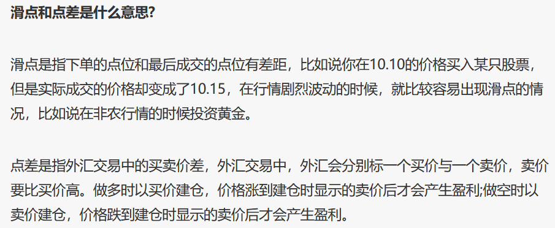
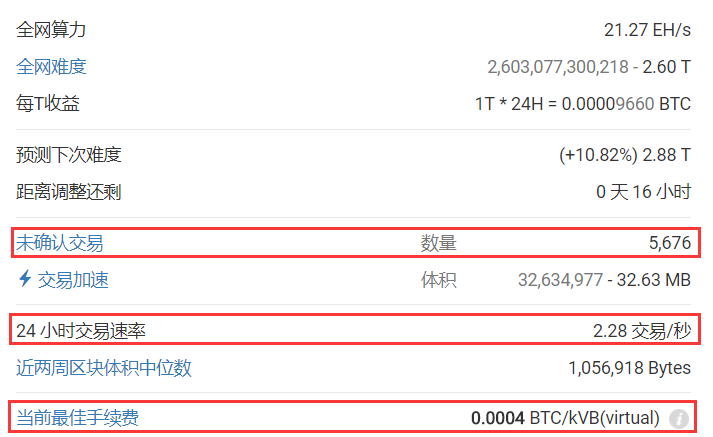
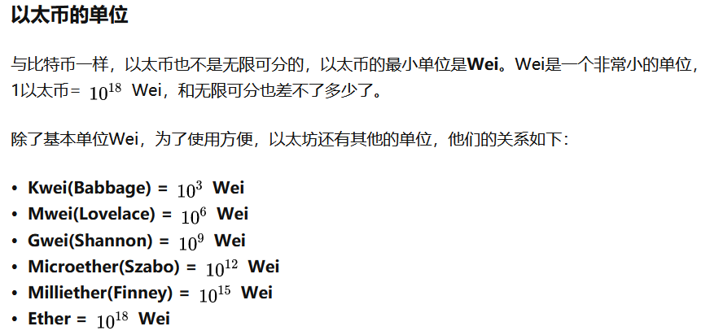
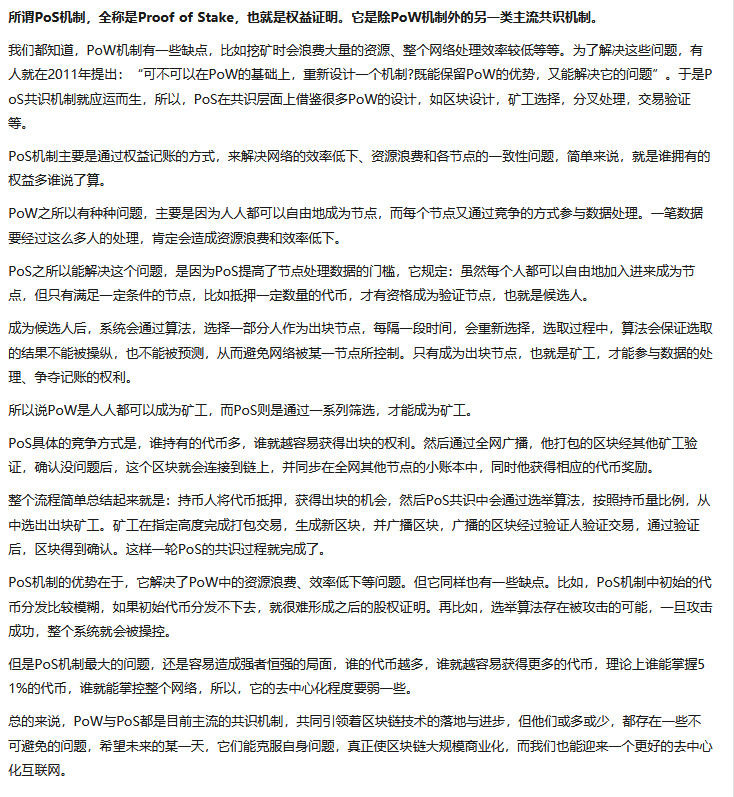
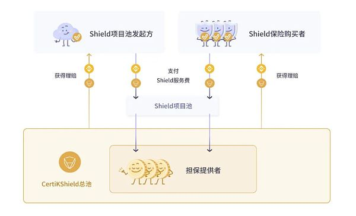
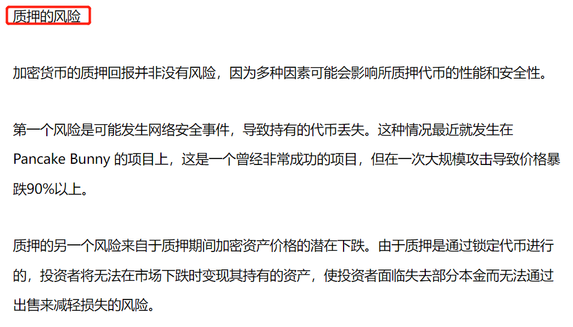
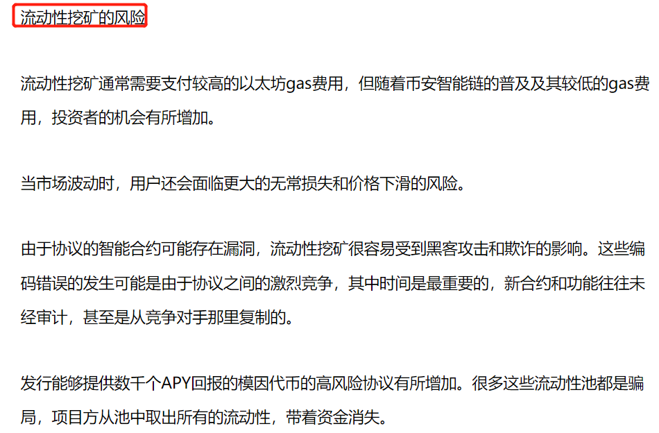
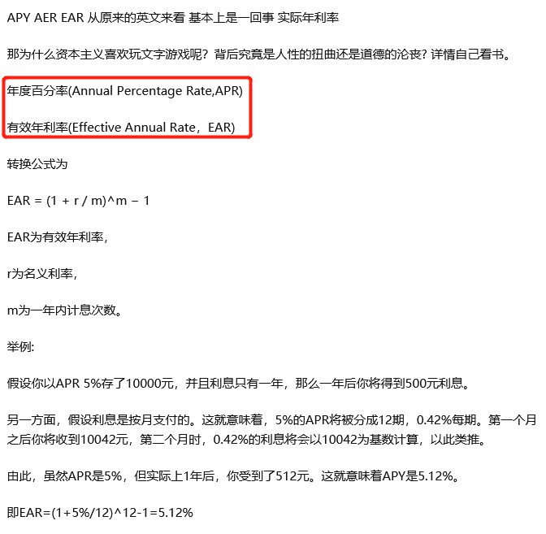

# 虚拟货币

## 什么是做空？

## 仓的概念

## DEX CEX的区别？

## 杠杆操作提示

高倍数的容易爆仓，但是投入资金小，典型的以小博大，单车变摩托

低倍数的不容易被爆仓，但是投入资金大，成本高，盈利能力不够强。

## 什么是交易深度？

交易深度是指市场在承受大额交易时币价不出现大幅波动的能力。一般在谈论交易深度时，指的是某个币种在某个平台的交易深度。

我们需要从挂单量和价差两个指标来理解交易深度，挂单数量大、相邻挂单之间的价差小，就说明交易深度好。

## 滑点

## 资金费率

当资金费率为正数时，多头支付空头；当资金费率为负数时，空头支付多头。

## 闪电网络

有过比特币提币、转账等交易的人相信都感受到过，整个比特币网络拥堵不堪，交易费节节攀升，对比传统金融结算系统已经没有速度上的优势。究其原因，无非是比特币的设计原因：**平均每10分钟出一个区块，每个区块大小为1M**。所以，每10分钟能打包确认的交易是有限的，同时由于矿工是趋利的，会有限打包手续费高的交易，导致交易费的攀升。

这个是闪电网络试运行一段时间后的交易费 
于是，比特币社区开启了旷日长久的扩容大战，。**大区块派主张链上扩容，而小区块派则坚持链下扩容。链下扩容的方案就是我们今天的主角闪电网络。**
**闪电网络以比特币区块链为后盾，在链下实现真正的点对点微支付交易，区块链处理能力的瓶颈被彻底打破，时延、最终性、容量甚至隐私问题也迎刃而解。**社区不少人甚至认为：“闪电网络”的论文（The Bitcoin Lightning Network: Scalable Off-Chain Instant Payments）对比特币的重要性仅在[中本聪](https://www.zhihu.com/search?q=中本聪&search_source=Entity&hybrid_search_source=Entity&hybrid_search_extra={"sourceType"%3A"answer"%2C"sourceId"%3A313185947})的创世论文之下，排名第二。
核心的概念主要有两个：RSMC（Recoverable Sequence Maturity Contract）和 HTLC（Hashed Timelock Contract）。前者解决了链下交易的确认问题，后者解决了支付通道的问题。
是不是看起来很复杂很难理解，没关系，我们可以用通俗的方法来理解。
**1.RSMC**
闪电网络的基础是交易双方之间的双向微支付通道，RSMC定义了该双向微支付通道的最基本工作方式。
假设A（Alice）和B（Bob）之间要打开一个支付通道，A和B则需分别往一个2-2签名的多重签名地址转入一定额度的比特币。
假设为{Alice: 0.4, Bob: 0.6}，意味着打入通道的资金共有1个 BTC，其中A拥有0.4 BTC，B拥有0.6 BTC。通道的设立会记录在比特币区块链上。通道的设立会记录在比特币区块链上。
假设B决定向A支付0.1 BTC，双方在链下对最新的分配方案{Alice:0.5, Bob:0.5} 签名认可，并签名同意作废上面的分配方案。
如果A打算终止通道并动用她的那份资金，她可以向区块链出示双方签字的余额分配方案。如果一段时间之内B不提出异议，区块链会终止通道并将资金按协议转入各自预先设立的提现地址。**如果B能在这段时间内提交证据证明A企图使用的是一个双方已同意作废的分配方案，则A的资金将被罚没并给到B。**
为了鼓励双方尽可能久地利用通道进行交易，RSMC对主动终止通道方给予了一定的惩罚：主动提出方其资金到账将比对方晚，因此谁发起谁吃亏。
**2.HTLC**
HTLC可以简单理解为，通过智能合约，双方约定转账方先冻结一笔钱，并提供一个哈希值，如果在一定时间内有人能提出一个字符串，使得它哈希后的值跟已知值匹配（实际上意味着转账方授权了接收方来提现），则这笔钱转给接收方。
这么做使得分配方案更复杂了，有何意义呢？
假设A想给C发送0.05 BTC，但A和C之间并没有微支付通道。但这没关系，A找到了一条经过B到达Ce的支付路径，该路径由A/B和B/C这样2个微支付通道串接而成。
**A签名了一个转账密文H给C**，由于A与C没有直接的支付通道，C收不到这笔转账。
现在，**A和 B商定一个HTLC**合约：只要B能在2天内向A出示正确的密文，A则支付B 0.051 BTC，否则钱会自动退还给A。
**B和 C商定一个HTLC**合约：只要C能在1天内向B出示正确的密文，B则支付C 0.05BTC，否则钱会自动退还给B。
现在，由于A已经把密文告诉了C，C只要向B出示正确的密文，就能收到0.05BTC。而多的0.001 BTC成了B的佣金，也可以理解为旷工费。
**3.闪电网络**
**这个交易机制可以扩展到非常多的人，也就形成了闪电网络。在整个交易中，智能合约起到了中介的重要角色，而区块链则确保最终的交易结果被确认。**
同时，由于有中间商可以赚佣金，闪电网络的支付通道未来也可能逐渐向少数大型中介集中，变成若干大型中介彼此互联、普通用户直连大型中介的形式。
那么，这样的比特币还是原来的比特币吗？这个蜕变到底是好还是坏呢？

## GWEI

## POS

## 从投资看权益质押、收益耕作和流动性挖矿究竟有什么区别？

DeFi刚兴起时，Staking（权益质押）、Yield Farming（收益耕作）和Liquidity Mining（流动性挖矿）这几个术语就迅速伴随掀起了一阵阵的狂潮。

它们具备许多共同点，有时甚至还可以互换使用，这就导致对于很多人来说，看到这几个词依旧是丈二和尚?

在听说了各种各样疯狂的挖矿收益、耕作收益后，想必你也非常想要了解这些术语究竟是什么意思，又是以什么方式获取收益的。

本篇将为你仔细分析这些概念的基本定义以及它们之间存在的关键性差异。

Staking（权益质押）

Staking是本文提到的这三个概念中应用最为广泛的一个。与另外两个表示流动性挖矿的术语不同，Staking有许多非加密定义，它可以帮助阐明在加密网络中抵押资产等行为的本质。

举一个比较简单的例子，我们常常提到“押”这个字，百度汉语的第一条释义便是——把财物交给对方作为保证。也就意味着人们将某样看重的东西置于危险之中以支持他们所信仰的其他事物，此行为的利益相关者可以是任何人。

而在加密世界中，Staking也是指提供抵押来作为一方在项目中状态证明的行为。这也同样意味着协议利益相关者的诚意，利益相关者通过抵押的行为展现出对他们对其支持协议的信任。

目前已经有多种方式可以支持各种加密和DeFi协议。以太坊 2.0 已成功的从工作量证明机制（PoW）过渡到权益证明机制（PoS）。

自此以后验证者不需要为网络提供哈希，只需要质押32ETH，便可用来验证以太坊网络上的交易并获得区块奖励。

其余收益模式例如——Polkadot等网络可允许DOT持有者在其提名权益证明 (NPoS) 共识机制中质押他们的代币并提名验证者节点，从而获得年收益率 (APY) 作为回报。其他协议则是要求抵押代币，以便用户参与治理决策并投票。

Coinbase、Nexo和BlockFi等中心化平台也允许用户质押他们的数字资产。

这些平台的工作方式类似于银行——获取小红的存款，而后将其以信贷的方式借给小明。小红和银行获取小明支付的利息。

对于潜在的利益相关者来说，需要明确一个问题，也就是代币为什么需要被抵押？

这些协议中，某些协议本质上需要质押来证明用户在项目中的状态或启用重要的财务功能，有些协议则仅将质押作为一种循环供应的方式，以提高代币的价格。

以CertiK去中心化资产保障计划CertiKShield为例，持有CTK的用户可以通过向抵押池提供流动性来获取高达30%的APY。这些被抵押的CTK，其经济功能十分重要：为在区块链网络上因被盗等原因导致无法追回的加密资产提供保险。

CertiKShield模型的功能与其他权益证明应用程序（例如PoS或集中信贷证明）不同，它将DeFi的开放性与安全性相结合，实现了一个全新的加密领域：去中心化的链上保险，可补偿在区块链网络上因被盗等原因导致无法追回的加密资产。而持有CTK的用户及利益相关者可通过抵押行为助力平台运营，并因其提供的价值而获得收益和奖励。

Yield Farming（收益耕作）

尽管Yield Farming（收益耕作）和Staking（权益质押）有许多相似之处，但是Yield Farming是一个比 Staking更加新颖的概念。

上文已提到，Staking可以指诸如锁定32ETH从而成为以太坊2.0验证节点之类的行为，而Yield Farming则专门指为DeFi协议提供流动性以换取收益的行为。

农民（Farmer）这个词就比较好理解，就是指活跃于各大DeFi协议中为自己的资产寻求最高收益的那批人。

Yield Farming有一个例子就是像Uniswap那样提供流动性到自动做市商（AMM）池。流动性提供者(LP)存入两种代币：代币A和代币 B。代币B通常是例如USDC或DAI那样的稳定币或ETH。该池用户在交易代币时支付的费用，将被作为回报给予于这些流动性提供者们。

这个收益是按照其存款所占资金池总量的百分比进行计算。也就是如果你存入的价值达到了整个资金池的1%，那么整个池子总支付收益的1%就是你的了。

但在双面流动性池（Double-sided Liquidity Pools）中获得高收入会面临一种风险——无常损失（Impermanent Loss）。

以ETH/DAI矿池为例，DAI是一种稳定币，但ETH并不是，因此随着ETH升值，AMM会调整存款人的两种资产的比率，以确保两者的价值保持不变。这就可能会造成无常损失：随着ETH升值，与初始DAI存款价值相等的ETH数量会减少，因此导致了价值与所存代币数量之间产生脱节。

如果这个时候你将存款取回，那这种本身是非永久性的损失将会变成永久性的。不过假如你的无常损失已经超过了收益，那最好还是将代币取出。

市场上有诸如Bancor之类的AMM提供单边存款服务以降低这种无常损失。而包括CertiKShield在内的一些其他收益耕作和计息产品从设计上就已规避了这种风险。

Yield Farming在项目的早期阶段可能会带来非常大的收益，毕竟这时候你持有的是“大额原始股”。但是加密领域从未缺少过固有波动性以及各类新型金融产品的开发，这也是你需要考虑的多重风险之一。

Liquidity Mining（流动性挖矿）

Liquidity Mining其实可以算作是Yield Farming的一个子集。

它们的主要区别在于流动性（Liquidity）提供者不仅可以像Yield Farming样获取收益，还可以获得平台自己的代币。对于流动性提供者来说，这种额外的收益可以抵消全部或者部分的无常损失。

比如说Compound，这项目就是用其治理代币COMP奖励用户，同时它是第一个引入这种激励计划的人。COMP代币不仅流向流动性提供者，还流向会债务人。这意味着所有Compound用户均可获得收益，并能参与协议的治理。

这颠覆了传统的金融模式。

但其他一些流动性挖矿计划是仅仅向流动性提供者(LP)提供收益的。通常流动性提供者可以在池中抵押代币——因此他们不仅可以获得原本的代币抵押奖励，还可以获得奖励的代币部分抵押所产生的收益。

尽管流动性挖矿因稀释持币者可能存在“通货膨胀”的问题，但是其往往拥有几个月至几年的时间来规范协议，因此总而言之，它依旧是一种将流动性引入DeFi平台的成功方式。

写在结尾

本文所提到的三个概念都是投资数字资产的方式。通过以上介绍，相信大家对于权益质押、收益耕作和流动性挖矿已经有所了解，

作为DeFi用户，你可以选择任何方式去获取收益，增加资产。但同时，你应该先要确保平台已经通过了完备的安全审计并且拥有保障安全性的方法和措施，充分考虑这些行为的潜在风险，并且了解该行为产生收益的方式与原理。

## 质押的风险

## 流动性挖矿的风险

## 年化的概念

## 流动性挖矿最常见的七个问题和解答

https://blog.cakedefi.com/zhs/zhs-7-most-faq-lm/

## 质押和流动性挖矿有合并的趋势？

质押和流动性挖矿曾经是两个完全不同的世界。然而，在最近时期，两者的定义有合并的趋势。虽然流动性挖矿专注于获得尽可能高的回报，以创造流动性为目标，但质押的目的已从帮助区块链网络保持安全扩大到在给定平台上质押代币，以赚取回报。

## 混币器 Tornado Cash

**涉及技术：零知识证明**
Tornado Cash 是以太坊网络上能够实现匿名交易的去中心化隐私协议。根据 Dune Analytics 数据显示，该平台的资金量自  2020 年 1 月以来一直保持着告诉增长，目前已经有近 70 万个ETH 存款于这个隐私池中，还有价值 2.8  亿美元的其他代币，Tornado Cash 已然变成以太坊最大的隐私解决方案。

那么Tornado Cash 是如何在以太坊上实现隐私的？主要思路就是打破收款人和资金目标地址之间在链上的关联。你可以将以太币存入  Tornado.cash  的智能合约中，然后使用另一个不同的地址提款。无论你何时将以太币提现到新地址，其他人都无法将存钱地址和提款地址挂钩，从而确保了绝对的隐私。在这种办法中，Tornado Cash 充当着一个代理，使用 zkSnark 证明来确保交易的 100%  匿名，而且这个过程是没有任何的托管行为的，在去中心化的链上就完成了。

## 币圈名词ICO,IFO,IEO,IDO和ILO的区别

**ICO：Initial Coin Offering 首次代币发行**

也可以说是空气币发行。很多发行机构以“基于比特币”这种噱头发行新的虚拟货币，币圈的散户需要用比特币或者ETH这种主流币去购买融资，换取空气币，发行机构融到大量主流代币之后，空气币上市，很多都破发了，甚至有些机构一走了之。ICO现在已经被很多国家明令禁止。

**IFO：Initial Fork Offering 首次分叉币发行**

分叉币，基于主流代币发行的一种衍生代币，IFO的好处就是，散户可以用主流币进行预挖矿而获得衍生代币，也可以理解为零成本，即使衍生代币破发（发行后一路跌，跌破发行价）也不会有什么损失，毕竟零成本。

IFO还有一种解释是**Initial Farm Offering**，也就是通过质押某特定TOKEN，然后获得购买将要发行的NEW TOKEN的资格，一般在SWAP网站比较常见。

**IEO：Initial Exchange Offering 首次交易币发行**

平台币，很多大的交易平台会发行自己的代币，比如BNB,OKT等等，这种代币的好处就是发行后直接上线交易所，有大平台做信用保障，相对稳当点儿。

**IDO：Initial Digital Assets Offering 首次数字资产发行**

用户可以通过质押自己的数字货币到交易平台，进行预挖矿操作，获得新代币奖励，质押的货币和获得的奖励代币一般可以灵活存取，这种赚币方式基本没有资金风险。

IDO还有一种解释是**Initial DEX Offering**，即首次交易平台发行。项目方将项目LAUNCH委托给DEX交易平台，平台对项目进行严格审核之后，确定LAUNCH日期，大家可以通过DEX平台的任务活动获取对应的IDO项目方新代币的空投奖励。

**ILO：Initial Lock-up Offering 首次锁仓发行**

用户可以通过锁仓操作，类似定期理财，将自己的数字货币质押到平台，到期后可以赎回，并获得新的代币奖励。与IDO的区别在于，ILO需要将数字货币锁定，不可以灵活存取。

**IGO：Initial Game Offering 首次游戏发行**

2021年是P2E概念游戏爆发的一年，这一年GameFi蓬勃发展，也就有了IGO的由来，很多新游戏都经过IGO进行发行，玩家可以在游戏发行前获得游戏的白名单，然后游戏厂商会进行Airdrop空投，使得玩家获得游戏NFT，即用相对低的价格获得游戏NFT进行游戏，运气好的当游戏上线之后直接转手卖掉，就可以获得可观的收益。

不过，随着越来越多的新链游发布，IGO变成了和IDO差不多的东西，游戏厂商在DEX发布自己的游戏，想要参与游戏的玩家，就必须在DEX获得购买游戏NFT的资格，这些资格基本都是通过质押DEX平台币获得。